**INTERNATIONAL BURCH UNIVERSITY**  
FACULTY OF ENGINEERING AND NATURAL SCIENCES  
DEPARTMENT OF INFORMATION TECHNOLOGIES

IBUgram Mobile Application for iOS

UNDERGRADUATE PROJECT  
Sead Smailagic

Mentor  
(mentor name, with academic title)

SARAJEVO  
2026  
IBUgram Mobile Application for iOS

Sead Smailagic

Report Submitted in Fulfillment of Requirement for the  
Undergraduate Project

INTERNATIONAL BURCH UNIVERSITY  
2025/2026  
**APPROVAL PAGE**

**Student name and surname:**  Sead Smailagic  
**Faculty:**			   		  Faculty of Engineering and Natural Sciences  
**Department:** 			   	  Information Technologies  
**Project Title:** 		   		  IBUgram Mobile Application  
**Date of Defense:** 		   	  2026

I certify that this final work satisfies all the requirements as a Undergraduate Project for the Bachelor degree in Computer Science Engineering.

………………………………………  
      Assoc. Prof. Dr. Dino Kečo  
       **Head of Department**

This is to certify that I have read this final work and that in my opinion it is fully adequate, in scope and quality, as an Undergraduate Project for the Bachelor degree in Computer Science Engineering.

……………………………………  
										(mentor name, with academic title)  
					        	        		**Mentor**

**Examining Committee Members**

|  | Title / Name and Surname | Affiliation | Signature |
| ----- | :---: | :---: | :---: |
| 1\. | (fill in the committee names) | head |  |
| 2\. | … | member |  |
| 3\. | … | member |  |

It is approved that this final work has been written in compliance with the formatting rules laid down by the Department of Information Technologies.

………………………………………  
 						           			**Head of Committee**

**IBUgram Mobile Application for iOS**

# **ABSTRACT** {#abstract}

IBUgram is a closed, photo-centric social network for the International Burch University community. Membership is restricted to university mailboxes: `@stu.ibu.edu.ba` for students and `@ibu.edu.ba` for faculty and staff. Inside that boundary the product behaves like a familiar campus feed — posts, profiles, a social graph, search, notifications and direct messages — and adds three capabilities a general-purpose network does not offer a university: Spaces (clubs, departments and courses), Campus Events (RSVP, map and calendar), and on-device content intelligence (Vision alt-text and Natural Language hashtag suggestion).

The system is a native iOS 18 client written in Swift 6 and SwiftUI, and a self-hosted Vapor 4 server backed by PostgreSQL 14. A shared Swift package, `IBUgramKit`, compiles the wire contract — data-transfer objects, error codes, endpoint paths and authentication constants — into both sides so the client and server cannot silently diverge. Authentication is passwordless email one-time passcode (OTP) exchanged for a short-lived JSON Web Token (JWT) access token and a rotating refresh token. Realtime delivery uses a WebSocket for messages, presence, typing and live notifications.

The architectural choice that shapes the rest of the work is the rejection of Firebase. A 2023 prototype used Firebase Authentication, Cloud Firestore and Google Sign-In. This project replaces that stack with an owned relational schema, an owned test harness, and a single-language full stack. The Senior Design Project requires an entity-relationship model and demonstrable unit, integration and system tests; a self-owned PostgreSQL schema and Vapor test suite satisfy both directly.

The author's personal engineering objective is equally explicit. The author is an experienced Android and React Native developer who had not previously shipped a native iOS application. IBUgram exists to close that gap: Swift 6 strict concurrency, SwiftUI, SwiftData's intended cache seam, Vision, Natural Language, MapKit, EventKit and WidgetKit as a product specification, implemented as a real campus product rather than a tutorial clone.

**Keywords:** Social Networking, SwiftUI, Swift 6, Vapor, PostgreSQL, University Community, OTP, WebSocket.

# **ACKNOWLEDGMENTS** {#acknowledgments}

I thank International Burch University and the Department of Information Technologies for the undergraduate programme that made this project possible, and for a campus community specific enough to be worth building for. I am grateful to my mentor for guidance on scope, on the difference between a portfolio demo and a defensible engineering argument, and on keeping the report honest about what was built.

I also thank the authors of the public documentation this work rests on: Apple's Swift, SwiftUI, Vision, Natural Language and Human Interface Guidelines; the Vapor and Fluent projects; and the PostgreSQL manual. Those sources are cited in the references.

Finally I thank my family for patience during a project that occupied evenings and weekends, and the classmates who were willing to talk through whether a university social network was a product worth making.

# **DECLARATION** {#declaration}

I hereby declare that this Undergraduate Project titled **IBUgram** is based on my original work except quotations and citations which have been duly acknowledged. I also declare that this work has not been previously or concurrently submitted for the award of any degree, at International Burch University, any other University or Institution.

………………………………  
				                   		        		Sead Smailagic

            						        			2026  
					 		            

**TABLE OF CONTENTS**

**[ABSTRACT](#abstract)**

**[ACKNOWLEDGMENTS](#acknowledgments)**

**[DECLARATION](#declaration)**

**[LIST OF TABLES](#list-of-tables)**

**[LIST OF FIGURES](#list-of-figures)**

**[LIST OF ABBREVIATIONS](#list-of-abbreviations)**

**[1. INTRODUCTION](#introduction)**

[1.1 Background](#background)

[1.2 Objective](#objective)

[1.3 Significance of the Project](#significance-of-the-project)

[1.4 Structure of the Paper](#structure-of-the-paper)

**[2. SYSTEM ANALYSIS](#system-analysis)**

[2.1 Product perspective and scope](#product-perspective-and-scope)

[2.2 Actors and capabilities](#actors-and-capabilities)

[2.3 Functional requirements](#functional-requirements)

[2.4 Non-functional requirements](#non-functional-requirements)

[2.5 Feasibility](#feasibility)

[2.6 Constraints, risks and mitigations](#constraints-risks-and-mitigations)

[2.7 Success criteria](#success-criteria)

[2.8 Comparison against Firebase (decision D-001)](#comparison-against-firebase-decision-d-001)

**[3. APPLICATION DESIGN](#application-design)**

[3.1 System context](#system-context)

[3.2 Use cases](#use-cases)

[3.3 Client architecture](#client-architecture)

[3.4 Server architecture](#server-architecture)

[3.5 Entity-relationship model](#entity-relationship-model)

[3.6 Sequence diagrams](#sequence-diagrams)

[3.7 Activity and communication](#activity-and-communication)

[3.8 Component and navigation design](#component-and-navigation-design)

[3.9 API design rationale](#api-design-rationale)

[3.10 Security design](#security-design)

**[4. IMPLEMENTATION](#implementation)**

[4.1 Languages, frameworks and justification](#languages-frameworks-and-justification)

[4.2 Environment and how to run the system](#environment-and-how-to-run-the-system)

[4.3 The shared IBUgramKit package](#the-shared-ibugramkit-package)

[4.4 Feature walkthrough](#feature-walkthrough)

[4.5 Selected code listings](#selected-code-listings)

**[5. SYSTEM TESTING](#system-testing)**

[5.1 Strategy](#strategy)

[5.2 Unit tests](#unit-tests)

[5.3 Integration tests](#integration-tests)

[5.4 System and UI tests](#system-and-ui-tests)

[5.5 Manual test matrix](#manual-test-matrix)

[5.6 Performance](#performance)

**[6. MAINTENANCE ANALYSIS](#maintenance-analysis)**

[6.1 Maintainability](#maintainability)

[6.2 Data integrity](#data-integrity)

[6.3 Security](#security)

[6.4 Backup, restore and crash recovery](#backup-restore-and-crash-recovery)

[6.5 Administration and moderation](#administration-and-moderation)

[6.6 Future work](#future-work)

**[7. CONCLUSION](#conclusion)**

**[REFERENCES](#references)**

**[APPENDICES](#appendices)**

[Appendix A — API reference](#appendix-a--api-reference)

[Appendix B — Database schema](#appendix-b--database-schema)

[Appendix C — Test inventory and reproduction commands](#appendix-c--test-inventory-and-reproduction-commands)

[Appendix D — How to build and run the system](#appendix-d--how-to-build-and-run-the-system)

# **LIST OF TABLES** {#list-of-tables}

Table 1.1 Structure of the paper  
Table 2.1 Locked platform decisions  
Table 2.2 Actors and capabilities  
Table 2.3 Functional requirements  
Table 2.4 Non-functional requirements  
Table 2.5 Constraints, risks and mitigations  
Table 2.6 Firebase versus Vapor + PostgreSQL  
Table 2.7 Release definition of done  
Table 3.1 Client navigation routes  
Table 3.2 Canonical API error codes and HTTP statuses  
Table 3.3 Foreign-key delete behaviour  
Table 3.4 Trigger-maintained counters  
Table 4.1 Languages and frameworks  
Table 4.2 Screenshots embedded in Chapter 4  
Table 5.1 Tests present in the repository by target  
Table 5.2 Manual test matrix  
Table 6.1 Threat model summary  
Table C.1 Server `@Test` inventory  
Table C.2 Client `@Test` inventory  
Table C.3 UITest methods  

# **LIST OF FIGURES** {#list-of-figures}

Figure 3.1 System context  
Figure 3.2 Use cases by actor  
Figure 3.3 Client layering  
Figure 3.4 Client class diagram  
Figure 3.5 Server class diagram  
Figure 3.6 Entity-relationship diagram  
Figure 3.7 Sequence — OTP sign-in  
Figure 3.8 Sequence — post creation with on-device alt text  
Figure 3.9 Sequence — realtime message delivery over WebSocket  
Figure 3.10 Activity — feed load with offline fallback  
Figure 3.11 Component / package diagram  
Figure 3.12 Navigation map  
Figure 4.1 Sign in (light)  
Figure 4.2 Sign in (dark)  
Figure 4.3 OTP verification (light)  
Figure 4.4 Onboarding (light)  
Figure 4.5 Early tab shell (light)  
Figure 4.5b Early tab shell (dark)  
Figure 4.6 Following feed with Happening now (light)  
Figure 4.7 Following feed (dark)  
Figure 4.8 Post composer (light)  
Figure 4.9 Post composer (dark)  
Figure 4.10 Post detail and comments (light)  
Figure 4.10b Post detail and comments (dark)  
Figure 4.11 Profile (light)  
Figure 4.11b Profile (dark)  
Figure 4.12 Search idle (light)  
Figure 4.12b Search idle (dark)  
Figure 4.13 Activity (light)  
Figure 4.13b Activity (dark)  
Figure 4.14 Messages inbox (light)  
Figure 4.14b Messages inbox (dark)  
Figure 4.15 Space — IBU Robotics (light)  
Figure 4.15b Space — IBU Robotics (dark)  
Figure 4.16 Event — Robotics open lab (light)  
Figure 4.16b Event — Robotics open lab (dark)  
Figure 4.17 Campus map (light)  
Figure 4.17b Campus map (dark)  

# **LIST OF ABBREVIATIONS** {#list-of-abbreviations}

**API**			Application Programming Interface  
**APNs**		Apple Push Notification service  
**ATS**			App Transport Security  
**CRUD**		Create, Read, Update, Delete  
**DTO**			Data Transfer Object  
**ER**			Entity-Relationship  
**EXIF**		Exchangeable Image File Format  
**FK**			Foreign Key  
**GIN**			Generalized Inverted Index  
**HIG**			Human Interface Guidelines  
**IBU**			International Burch University  
**JWT**			JSON Web Token  
**NFR**			Non-Functional Requirement  
**ORM**			Object-Relational Mapping  
**OTP**			One-Time Passcode  
**PK**			Primary Key  
**REST**		Representational State Transfer  
**RFC**			Request for Comments  
**SDK**			Software Development Kit  
**SPM**			Swift Package Manager  
**SQL**			Structured Query Language  
**TLS**			Transport Layer Security  
**UI/UX**		User Interface / User Experience  
**URL**			Uniform Resource Locator  
**UUID**		Universally Unique Identifier  
**WS**			WebSocket  
**XCUITest**	Xcode User Interface Test  

1. # **INTRODUCTION** {#introduction}

1. ## **Background** {#background}

International Burch University is a small, bilingual campus in Sarajevo. Students, faculty and staff already live on general-purpose social networks, but those networks were not designed around a university membership boundary. Anyone with a phone can join them. There is no first-class notion of a department, a course, a student club or a campus place. Official notices compete with whatever the ranking function happens to surface. Events are posters in corridors, messages in informal group chats, and calendar entries that never make it into a shared view of the week.

A general-purpose network cannot solve that problem by adding a hashtag. Hashtags are not membership. They do not prove that the person posting is a student or a member of staff. They do not give a faculty member a distinct capability to create an official Space or to publish an event to the whole campus. They do not give a moderator a queue. They do not keep a visitor from outside the university from reading, posting or messaging.

IBUgram starts from that observation. The product is not "Instagram, but with the university logo". It is a closed network whose first rule is the email domain. Only `@ibu.edu.ba` and `@stu.ibu.edu.ba` addresses may hold an account. Role is derived from that domain: students on the student subdomain, faculty and staff on the staff domain, with an automatic verified badge for faculty. Inside the boundary the interaction model is familiar on purpose — a photo feed, profiles, follows, comments, saves and direct messages — because the cost of inventing a new social vocabulary would be paid by the same people the product is trying to serve. The university-specific work sits on top of that vocabulary: Spaces, Campus Events, a campus map, and on-device analysis that never sends a photo off the phone in order to describe it.

A 2023 prototype of the same product idea existed in this repository as a baseline. It used Firebase Authentication, Cloud Firestore and Google Sign-In. That prototype demonstrated that a SwiftUI shell could be stood up, but it could not produce the artefacts this degree programme asks for: a relational schema, a testable service layer, and a self-contained defence. The work reported here replaces that prototype rather than extending it.

2. ## **Objective** {#objective}

The project has two objectives, and they are both binding.

The **product objective** is to deliver a closed, verified campus network for International Burch University. Membership is proven by control of a university mailbox, not by a post-hoc check on an OAuth identity. The v1.0 surface is specified in `docs/00-PRODUCT-SPEC.md`: identity and access, two feeds, posts and comments, profiles and the social graph, search, direct messaging, notifications, Spaces, Campus Events, on-device intelligence, an offline-readable cache, and accessibility and polish including VoiceOver, Dynamic Type and dark mode. Explicitly out of scope for v1.0 are Stories, Reels, video posts, advertising, and public unauthenticated access.

The **personal engineering objective** is to ship a native iOS application as a developer whose production experience is Android and React Native. That sentence is the honest framing of the technology choices. Swift 6 strict concurrency, SwiftUI's declarative layout, Keychain-backed session storage, an `actor`-isolated `APIClient`, Vision and Natural Language running on the device, MapKit and EventKit, and a Vapor server written in the same language as the client are not fashionable selections. They are the curriculum the author needed. A React Native client talking to Firebase would have been faster to assemble and would have taught almost nothing the author did not already know. The report therefore treats the move to native iOS and to server-side Swift as part of the contribution, not as an implementation detail.

3. ## **Significance of the Project** {#significance-of-the-project}

The significance of IBUgram is threefold.

First, it consolidates campus content. Posts, Spaces, events and geo-tagged campus places share one feed, one search index and one notification stream. A robotics club announcement, a career-fair RSVP and a photo from the lawn are not three different apps.

Second, it enforces verified identity. Domain-restricted OTP is the membership test. Faculty accounts carry a verified badge derived from the staff domain. Official Spaces can be created only by faculty. That is a different privacy and trust posture from an open network, and it is the reason the product can offer campus-wide Discover ranking without inviting the public internet onto the campus lawn.

Third, it keeps content intelligence on the device. Alt-text generation and scene classification run through Vision at compose time. Hashtag suggestion, language identification and a sentiment score used as a soft ranking signal run through Natural Language. No image leaves the phone for analysis. The privacy claim is therefore architectural rather than policy: the bytes are never sent to an inference service, so they cannot be retained by one.

The engineering significance sits beside the product significance. The shared `IBUgramKit` package, the 28-table PostgreSQL schema with trigger-maintained counters, refresh-token families with reuse detection, and cursor pagination are the parts of the work that would transfer to another campus or another closed community. They are also the parts a Firebase prototype could not exhibit at a defence.

4. ## **Structure of the Paper** {#structure-of-the-paper}

*Table 1.1 Structure of the paper*

| Chapter | Contents |
| :---- | :---- |
| 1 Introduction | University context, product and personal objectives, significance, roadmap |
| 2 System analysis | Scope, actors, functional and non-functional requirements, feasibility, risks, success criteria, Firebase versus Vapor |
| 3 Application design | Context, use cases, class, ER, sequence, activity, communication, components, navigation, API and security design |
| 4 Implementation | Languages, environment, `IBUgramKit`, feature walkthrough with screenshots, selected listings |
| 5 System testing | Test pyramid as applied, unit / integration / UI tests, manual matrix, performance method |
| 6 Maintenance analysis | Maintainability, integrity, security, backup, administration, future work |
| 7 Conclusion | Benefits, learning, limitations, recommendations |
| References | Primary platform documentation and related literature |
| Appendices | API reference, schema, test inventory, build instructions |

The remainder of the paper follows that order. Chapter 2 is the requirements and trade-off chapter; it is where decision D-001 is defended. Chapter 3 is the design chapter and owns every diagram. Chapter 4 is the implementation chapter and owns the screenshots. Chapter 5 reports tests that exist in the repository and the commands that reproduce them; it does not invent pass counts or timings. Chapter 6 treats the system as something that must be operated after the defence. Chapter 7 is brief on purpose.

2. # **SYSTEM ANALYSIS** {#system-analysis}

2.1 ## **Product perspective and scope** {#product-perspective-and-scope}

IBUgram is a three-part system: a native iPhone application, a Vapor HTTP and WebSocket server, and a PostgreSQL database. The client is the only user-facing product. There is no public web client in v1.0. The server is not a Backend-as-a-Service console; it is a Swift executable the author can build, migrate and test locally.

*Table 2.1 Locked platform decisions*

| Concern | Decision |
| --- | --- |
| Client | Native iOS, SwiftUI, iOS 18.0 minimum, Swift 6 strict concurrency |
| Server | Vapor 4 (Swift), PostgreSQL 14, Fluent ORM |
| Shared code | `IBUgramKit` Swift package — DTOs and endpoint contract compiled into both client and server |
| Auth | Passwordless email OTP, domain-restricted, JWT access + refresh |
| Realtime | WebSocket (messaging, presence, typing, live notifications) |
| Media | Server-side storage with on-disk blob store behind a `MediaStore` protocol |
| Local persistence | Cache seam (`OfflineCaching`) with a file-system implementation; SwiftData outbox specified as the replacement |

The product specification locks the in-scope feature set and is equally explicit about what is out of scope for v1.0:

- Stories
- Reels
- Video posts
- Advertising
- Public (unauthenticated) access

Those exclusions are product decisions, not unfinished work. A Stories surface would require a different media pipeline, a different retention model and a different notification load. Video would require transcoding the project does not own. Advertising would invert the membership rule. Public access would destroy the closed-community claim.

The specification also names four P1 "standout" areas that distinguish the product from a generic clone: Spaces, Campus Events, on-device intelligence, and offline-first behaviour, plus system extensions (WidgetKit and App Intents). Chapter 4 reports what was implemented in the repository against that list. WidgetKit and App Intents are specified and are not present as source files; they are called out as future work rather than as delivered features.

2.2 ## **Actors and capabilities** {#actors-and-capabilities}

Four actors appear in the product specification. Three of them are people; one is the system itself.

*Table 2.2 Actors and capabilities*

| Actor | Source | Capabilities |
| --- | --- | --- |
| Student | `@stu.ibu.edu.ba` | Full social participation; join Spaces; RSVP to Events |
| Faculty / Staff | `@ibu.edu.ba` | Everything a Student can do, plus create **official** Spaces and publish Events to the whole campus. Carries a verified badge. |
| Moderator | Flag on account | Review reports, hide content, suspend accounts |
| System | — | OTP delivery, notification fan-out, feed ranking, event reminders |

The student/faculty split is derived from the email domain at account creation. It is not a self-serve role picker. The moderator flag is an account attribute (`users.is_moderator`) rather than a separate identity provider. The system actor does not hold an account; it is the set of services that issue OTPs, group notifications, rank the Discover feed and remind attendees of events.

Use-case coverage by actor is summarised in Figure 3.2. The important permission boundaries, which later become authorization tests, are:

- Only a university domain may request an OTP.
- Only faculty may create a Space with `is_official = true` (the server answers `403` otherwise).
- Event RSVP `going` is capacity-checked under `SELECT … FOR UPDATE`; overflow is `409`.
- Message requests from non-followed users land in a Requests inbox and do not increment the unread badge until accepted.
- Reports are filed by any signed-in user and handled by a moderator.

2.3 ## **Functional requirements** {#functional-requirements}

The following requirements are numbered so they can be traced to features, tests and screens. They are restated from the locked product specification, not invented for the report.

*Table 2.3 Functional requirements*

| ID | Priority | Requirement |
| --- | --- | --- |
| FR-1 | P0 | A user signs in with a university email and a 6-digit OTP; the session is a JWT access token plus a rotating refresh token. |
| FR-2 | P0 | Role is derived from domain; faculty accounts are badge-verified. |
| FR-3 | P0 | First-run onboarding captures display name, username, avatar, department and year of study. `needs_onboarding` is the only client signal that onboarding is incomplete. |
| FR-4 | P0 | Sessions are listed and revocable in Settings; tokens live in the Keychain. Optional biometric app lock is available. |
| FR-5 | P0 | Two feeds: Following (reverse-chronological from followed users and Spaces) and Discover (campus-wide, ranked). Cursor-paginated, pull-to-refresh, infinite scroll, skeleton loading. |
| FR-6 | P0 | A post card shows author, media carousel, caption with linkified hashtags and mentions, like, comment, save, share, and Space / Event / location chips. Double-tap likes are optimistic. |
| FR-7 | P0 | Composer: up to 10 images, crop, caption, hashtags, mentions, optional Space, optional campus location, optional Event. Edit caption, delete, disable comments, archive. |
| FR-8 | P0 | Comments with one level of replies and comment likes. |
| FR-9 | P0 | Saves with optional collection name. |
| FR-10 | P0 | Profile with avatar, display name, username, bio, department, role badge, counts, post grid, saved tab (self), tagged tab, follow/unfollow, followers and following, block and report. |
| FR-11 | P0 | Unified search across users, hashtags, Spaces and captions (PostgreSQL full-text). Recent searches, trending hashtags, department suggestions. |
| FR-12 | P0 | 1:1 and group conversations over WebSocket: text and image, typing, read receipts, presence, unread badges, message requests. |
| FR-13 | P0 | Activity feed: likes, comments, replies, follows, mentions, Space invites, Event reminders. Live over WebSocket while connected; grouped ("X and 4 others liked your post"). |
| FR-14 | P1 | Spaces: club / department / course / community; public, request-to-join or invite-only; join/leave; Space feed; faculty-only official Spaces. |
| FR-15 | P1 | Events: title, start/end, place, capacity, RSVP going / interested / none, happening-now rail, campus map, Add to Calendar via EventKit. |
| FR-16 | P1 | On-device Vision alt-text and scene labels at compose time; Natural Language hashtag, language and sentiment signals. No image leaves the device for analysis. |
| FR-17 | P1 | Readable offline cache; outbox for posts, likes, comments and messages created offline, replayed on reconnect. Network-state banner. |
| FR-18 | P1 | WidgetKit home-screen widget and App Intents ("Post to IBUgram", "What's happening at Burch?") — specified; not present as source in this repository (see §6.6). |
| FR-19 | P1 | VoiceOver labels, Dynamic Type through XXL, Reduce Motion, contrast-checked palette, complete dark mode, haptics. |
| FR-20 | P2 | Report post/comment/user; moderator queue; hide and suspend; audit fields on the report row. |

2.4 ## **Non-functional requirements** {#non-functional-requirements}

Source: product specification §5.

*Table 2.4 Non-functional requirements*

| ID | Requirement |
| --- | --- |
| NFR-1 | Feed page (20 posts) returns in under 300 ms at p95 on the reference dataset |
| NFR-2 | Cold launch to rendered cached feed under 1.5 s |
| NFR-3 | All traffic over TLS in deployment; tokens only in Keychain |
| NFR-4 | Passwords never stored — OTP only; OTP expires in 10 minutes, 5 attempts max |
| NFR-5 | App remains usable read-only with zero connectivity |
| NFR-6 | Server test suite covers every endpoint; client covers view models and services |
| NFR-7 | Swift 6 strict concurrency enabled, zero warnings |
| NFR-8 | VoiceOver can complete every primary user journey |

NFR-4 is implemented as constants in `IBUgramKit` (`otpLifetime = 600`, `otpMaxAttempts = 5`) and enforced by `OTPService`. NFR-3 is a deployment requirement: development talks to `http://127.0.0.1:8080` with App Transport Security exceptions for local networking; production must terminate TLS. NFR-1 and NFR-2 are stated with a method in Chapter 5; this repository does not contain recorded p95 timings, so none are reported.

2.5 ## **Feasibility** {#feasibility}

**Technical.** The stack is conventional on each side and unusual only in that both sides are Swift. iOS 18, SwiftUI and Swift 6 are the current native baseline. Vapor 4, Fluent and PostgreSQL are a documented, testable server stack. Vision and Natural Language ship with the operating system, which is why on-device intelligence has zero marginal server cost. WebSockets are a first-class Vapor feature. The remaining technical risk is not "can this be built" but "can one developer finish the P0 and P1 surface in the time available". That risk is accepted in §2.6.

**Schedule.** The work was sequenced in five phases documented in `docs/03-TEAM-AND-PROCESS.md`: repository and contract; shared package plus server foundation plus iOS architecture; backend and iOS feature groups in parallel; standout features; integration, seeded data, screenshots and this report. Phase 1 is the critical path, because nothing downstream can start until the contract compiles and the app builds. Git history on `main` matches that sequence: baseline and spec, iOS foundation (Firebase removed), backend foundation (schema, auth, media), iOS feature modules, backend feature groups, contract unification and populated screenshots, then Spaces, Events, map and messaging wired into navigation.

**Economic.** A managed backend (Firebase in the 2023 prototype) is cheap at campus scale until the day the project must be reproduced by a committee that does not have the author's console login. A self-hosted Vapor process plus PostgreSQL on a laptop is free for development and defence. Deployment cost, if the university later hosts the server, is a virtual machine and a managed Postgres instance — an operating expense, not a per-seat SaaS bill. The trade-off given up is managed push infrastructure: Apple Push Notification service (APNs) requires a paid Apple Developer account, which this project does not have. Live notifications are therefore delivered in-app over the WebSocket while the app is connected. That is a product limitation with an architectural seam behind it, not an accidental omission.

2.6 ## **Constraints, risks and mitigations** {#constraints-risks-and-mitigations}

*Table 2.5 Constraints, risks and mitigations*

| Constraint or risk | Effect | Mitigation |
| --- | --- | --- |
| No paid Apple Developer account | APNs cannot be delivered | Push transport is a protocol seam; v1.0 delivers live events over WebSocket. Widgets and TestFlight distribution are similarly blocked. |
| Single developer | Parallel feature work still has one integrator | Frozen API contract; exclusive file ownership during implementation; `IBUgramKit` as the only shared surface. |
| iOS 18 minimum | Older devices excluded | Acceptable for a university-internal app; iOS 18 is two major versions behind the current simulator target used in this repository (iPhone 17 Pro, iOS 26.3.1). |
| Development OTP printed to logs / returned as `debug_code` | Codes must not leak in production | Field is absent outside the development environment; production must use a real `EmailSender`. |
| DTO fragmentation during parallel iOS work | Local `Post` types omitted Space / Event / location chips | Documented as integration debt in `docs/PROGRESS.md`; later commit unified the client on `IBUgramKit`. |
| Shared PostgreSQL test database | Concurrent Swift Testing suites would collide | `ExclusiveDatabaseAccess` actor serialises tests; schema prepared once per process. |
| English stemming mangles Bosnian | Search quality | Full-text search uses PostgreSQL `simple`, not `english`. |

The honest constraint is the first one. A defence that claimed production push notifications would be a claim the author cannot demonstrate. The report therefore does not claim them.

2.7 ## **Success criteria** {#success-criteria}

Source: product specification §6.

*Table 2.7 Release definition of done*

| # | Criterion |
| --- | --- |
| 1 | Server builds, migrates and passes its full test suite against PostgreSQL. |
| 2 | App builds for the iOS 26 simulator with zero warnings and passes unit + UI tests. |
| 3 | A seeded demo dataset produces a visually complete app for screenshots. |
| 4 | Every P0 and P1 feature is reachable from the UI. |
| 5 | `Senior Design Project.md` is complete with diagrams and screenshots. |

Criterion 5 is this document. Criteria 1–2 are reproduced by the commands in Appendix C and D; pass/fail output is not fabricated here. Criterion 3 is evidenced by the populated screenshots in `docs/screenshots/` (the `1x-*` series). Criterion 4 is true of the P0 surface and of Spaces, Events, map, messaging, Vision/Natural Language services and the offline cache protocol; it is not true of WidgetKit and App Intents, which remain specified but unimplemented.

2.8 ## **Comparison against Firebase (decision D-001)** {#comparison-against-firebase-decision-d-001}

Decision D-001, dated 2026-09-20, replaces Firebase entirely with a Vapor 4 service backed by PostgreSQL 14 and a shared `IBUgramKit` package.

The 2023 prototype used Firebase Auth, Firestore and Google Sign-In. That is a reasonable stack for a weekend demo. It is the wrong stack for this degree project, for four reasons that were recorded when the decision was taken and that still hold.

**1. The report requires an entity-relationship model and test results.** Chapter 3 must present an ER diagram of the database. Chapter 5 must present unit, integration and system tests. Firestore is a schemaless document store. There is no ER diagram of a collection group that a committee can mark, and there is no owned integration-test harness that starts from `DROP SCHEMA public CASCADE` and rebuilds 28 tables. A relational schema with 34 reversible Fluent migrations, CHECK constraints, GIN indexes and trigger-maintained counters is an artefact. A Firebase console is an account.

**2. The build must be self-contained.** Firebase ties the project to a console that cannot be provisioned or verified reproducibly. A committee member who clones the repository cannot create the author's Firebase project, cannot rotate the author's API keys, and cannot inspect security rules without that login. A Vapor process and a local Postgres database have no such dependency. `.env.example` is the entire operations surface for development.

**3. Domain-restricted passwordless auth is a first-class requirement.** The membership rule is "you hold an `@ibu.edu.ba` or `@stu.ibu.edu.ba` mailbox". Proving control of that mailbox *is* the membership test. Implementing OTP, hashing the code with Bcrypt, throttling issuance, consuming the challenge once, and issuing a rotating refresh token is straightforward in an owned service. Bending Google Sign-In to enforce a university domain after the fact is a post-hoc check on an identity the product does not control, and it reintroduces a password (or an OAuth round-trip) the security analysis is trying to eliminate.

**4. One language is the engineering narrative.** The author is demonstrating native iOS competence and, in the same move, server-side Swift. DTOs that compile on both sides make a class of production defect — the client sending a field the server renamed last Tuesday — a compile error. That is a stronger story at a defence than "the iOS app talks to a Google document store through a generated SDK".

*Table 2.6 Firebase versus Vapor + PostgreSQL*

| Concern | Firebase (2023 prototype) | Vapor + PostgreSQL (this project) |
| --- | --- | --- |
| Schema | Schemaless collections | 28 tables, CHECK constraints, documented delete rules |
| ER diagram for Chapter 3 | Not a native artefact | Figure 3.6, copied from `docs/10-DATA-MODEL.md` |
| Tests for Chapter 5 | Console and client mocks | Swift Testing against a real `ibugram_test` database |
| Auth | Google Sign-In | Domain-restricted OTP, JWT, refresh families |
| Reproducible defence | Requires a Google account | `swift test` and `xcodebuild test` |
| Push | Free FCM/APNs glue | Given up; WebSocket while connected |
| Hosting | Managed | Self-hosted process |
| Language | Swift client, proprietary backend | Swift client, Swift server, shared kit |

**What was given up.** Managed hosting, free push infrastructure, and one-tap Google SSO. Push is the costly one, and it is mitigated rather than ignored: the client already has a `WebSocketClient` actor with exponential backoff, and the server already fans out `notification_created` and `unread_count_changed` frames. SSO convenience is mitigated by a 60-day rotating refresh token, so a student authenticates with email roughly twice a year rather than every launch.

Decision D-002 (OTP instead of Google Sign-In) is the auth half of the same argument and is not repeated here except to note that removing password storage from the system simplifies Chapter 6. Decision D-003 (iOS 18, Swift 6) is the client half of the personal objective. Decision D-004 (synchronized Xcode file groups) is a process decision: a project that grows past a hundred Swift files cannot be maintained by hand-editing `project.pbxproj`. Decision D-005 (Discover ranking) is discussed with the feed implementation.

The remainder of this paper assumes D-001. There is no Firebase dependency in the iOS project or the server package.

3. # **APPLICATION DESIGN** {#application-design}

3.1 ## **System context** {#system-context}

*Figure 3.1 System context*

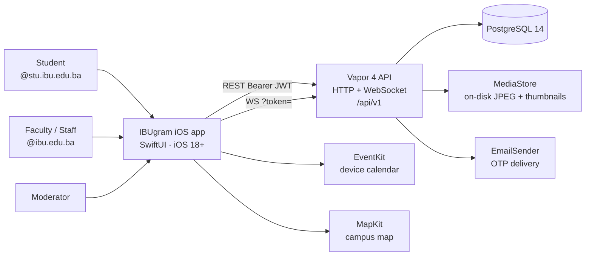
```mermaid
flowchart LR
    Student["Student<br/>@stu.ibu.edu.ba"]
    Faculty["Faculty / Staff<br/>@ibu.edu.ba"]
    Moderator["Moderator"]
    App["IBUgram iOS app<br/>SwiftUI · iOS 18+"]
    API["Vapor 4 API<br/>HTTP + WebSocket<br/>/api/v1"]
    DB[(PostgreSQL 14)]
    Media["MediaStore<br/>on-disk JPEG + thumbnails"]
    Mail["EmailSender<br/>OTP delivery"]
    Cal["EventKit<br/>device calendar"]
    Map["MapKit<br/>campus map"]

    Student --> App
    Faculty --> App
    Moderator --> App
    App -->|"REST Bearer JWT"| API
    App -->|"WS ?token="| API
    App --> Cal
    App --> Map
    API --> DB
    API --> Media
    API --> Mail
```

The iOS app is the only interactive client. It talks to the server over REST for CRUD and over a WebSocket for live frames. MapKit and EventKit are on-device frameworks; they do not go through the API. OTP mail is a server port (`EmailSender`); in development the implementation is `ConsoleEmailSender`, which prints the code and, in the development environment only, the `request-code` response may include `debug_code`.

3.2 ## **Use cases** {#use-cases}

*Figure 3.2 Use cases by actor*

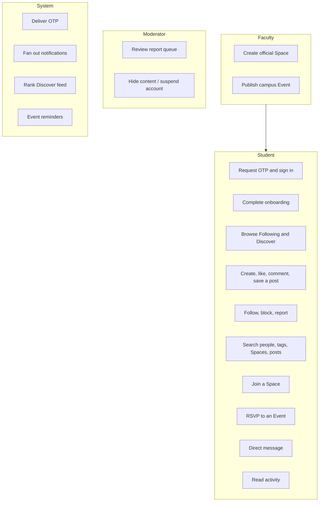
```mermaid
flowchart TB
    subgraph StudentUC [Student]
        UC1[Request OTP and sign in]
        UC2[Complete onboarding]
        UC3[Browse Following and Discover]
        UC4[Create, like, comment, save a post]
        UC5[Follow, block, report]
        UC6[Search people, tags, Spaces, posts]
        UC7[Join a Space]
        UC8[RSVP to an Event]
        UC9[Direct message]
        UC10[Read activity]
    end

    subgraph FacultyUC [Faculty]
        UC11[Create official Space]
        UC12[Publish campus Event]
    end

    subgraph ModUC [Moderator]
        UC13[Review report queue]
        UC14[Hide content / suspend account]
    end

    subgraph SysUC [System]
        UC15[Deliver OTP]
        UC16[Fan out notifications]
        UC17[Rank Discover feed]
        UC18[Event reminders]
    end

    FacultyUC --> StudentUC
```

Faculty inherit every student use case. The two additional faculty use cases are the ones the server enforces with role checks rather than with UI hiding: official Spaces and campus-wide events. Moderators additionally handle reports. The system use cases have no interactive actor.

3.3 ## **Client architecture** {#client-architecture}

The iOS app is layered. Dependencies point downward only. The diagram below is copied from `docs/11-IOS-ARCHITECTURE.md`.

*Figure 3.3 Client layering*

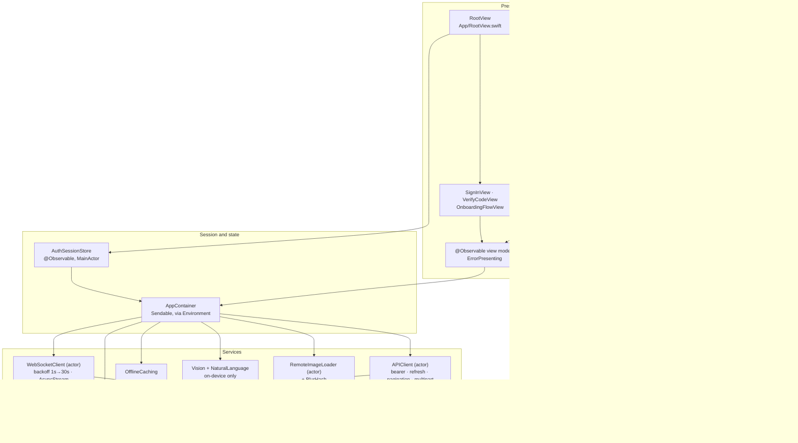
```mermaid
graph TD
    subgraph Presentation
        Root["RootView<br/>App/RootView.swift"]
        Shell["AppShellView<br/>five-tab TabView"]
        AuthUI["SignInView · VerifyCodeView<br/>OnboardingFlowView"]
        Feature["Feature screens<br/>Features/*"]
        VM["@Observable view models<br/>ErrorPresenting"]
    end

    subgraph Navigation
        Router["Router (per tab)<br/>Navigation/Router.swift"]
        RouteEnum["Route enum<br/>Navigation/Route.swift"]
        Dest["RouteDestinationView"]
    end

    subgraph DesignSystem["Design system"]
        Theme["Theme<br/>colours · type · spacing · radii · shadows · motion"]
        Components["Components/*<br/>Avatar · buttons · fields · chips · skeletons · states"]
    end

    subgraph Domain["Session and state"]
        Session["AuthSessionStore<br/>@Observable, MainActor"]
        Container["AppContainer<br/>Sendable, via Environment"]
    end

    subgraph Services
        API["APIClient (actor)<br/>bearer · refresh · pagination · multipart"]
        WS["WebSocketClient (actor)<br/>backoff 1s→30s · AsyncStream"]
        Tokens["KeychainTokenStore (actor)"]
        Cache["OfflineCaching"]
        Intel["Vision + NaturalLanguage<br/>on-device only"]
        Images["RemoteImageLoader (actor)<br/>+ BlurHash"]
    end

    Kit["IBUgramKit<br/>DTOs + Endpoint contract"]

    Root --> Session
    Root --> AuthUI
    Root --> Shell
    Shell --> Router
    Shell --> Feature
    Feature --> VM
    Feature --> Components
    AuthUI --> VM
    Router --> RouteEnum
    Router --> Dest
    Dest --> Feature
    Components --> Theme
    VM --> Container
    Session --> Container
    Container --> API
    Container --> WS
    Container --> Tokens
    Container --> Cache
    Container --> Intel
    Container --> Images
    API --> Tokens
    WS --> Tokens
    API --> Kit
    WS --> Kit
```

There are no singletons. Every service is reached through one `Sendable` `AppContainer` injected via the SwiftUI environment. `AppContainer.live()` wires real services; `AppContainer.preview()` wires `MockAPIClient`, `InMemoryTokenStore`, `NullOfflineCache` and stub intelligence, so every `#Preview` works without a network. Launch arguments `-ibugram-mock-api YES` and `-ibugram-auth-state signed-in|onboarding|signed-out` are how UI tests and screenshot capture run without a backend.

`AuthSessionStore` is `@MainActor @Observable` and is the only source of truth for who is signed in: `loading`, `signedOut`, `onboarding(User)`, `signedIn(User)`. `RootView` switches on that state.

*Figure 3.4 Client class diagram*

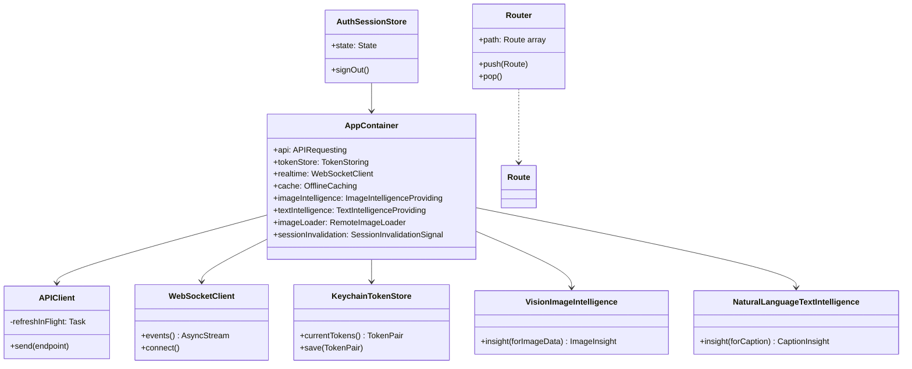
```mermaid
classDiagram
    class AppContainer {
        +api: APIRequesting
        +tokenStore: TokenStoring
        +realtime: WebSocketClient
        +cache: OfflineCaching
        +imageIntelligence: ImageIntelligenceProviding
        +textIntelligence: TextIntelligenceProviding
        +imageLoader: RemoteImageLoader
        +sessionInvalidation: SessionInvalidationSignal
    }

    class AuthSessionStore {
        +state: State
        +signOut()
    }

    class APIClient {
        -refreshInFlight: Task
        +send(endpoint)
    }

    class WebSocketClient {
        +events() AsyncStream
        +connect()
    }

    class KeychainTokenStore {
        +currentTokens() TokenPair
        +save(TokenPair)
    }

    class Router {
        +path: Route array
        +push(Route)
        +pop()
    }

    class VisionImageIntelligence {
        +insight(forImageData) ImageInsight
    }

    class NaturalLanguageTextIntelligence {
        +insight(forCaption) CaptionInsight
    }

    AppContainer --> APIClient
    AppContainer --> WebSocketClient
    AppContainer --> KeychainTokenStore
    AppContainer --> VisionImageIntelligence
    AppContainer --> NaturalLanguageTextIntelligence
    AuthSessionStore --> AppContainer
    Router ..> Route
```

3.4 ## **Server architecture** {#server-architecture}

The server follows the engineering standard: controllers are thin (decode, authorize, delegate, encode); business logic lives in services; persistence lives in Fluent models. Routes are registered from `IBUgramKit.Endpoint` values so the server's route table and the client's URL builder stay identical.

*Figure 3.5 Server class diagram*


```mermaid
classDiagram
    class AuthController
    class UserController
    class FeedController
    class PostController
    class SpaceController
    class EventController
    class ConversationController
    class MessageController
    class RealtimeController
    class MediaController
    class ReportController

    class OTPService {
        +issueChallenge()
        +consumeChallenge()
    }
    class TokenService {
        +startSession()
        +rotateSession()
        +revokeFamily()
    }
    class AccountService
    class FeedService
    class PostService
    class SpaceService
    class EventService
    class ConversationService
    class MessageService
    class NotificationService
    class ReportService
    class ImageProcessor {
        +process(Data) ProcessedImage
    }

    class UserRecord
    class OTPChallengeRecord
    class AuthSessionRecord
    class PostRecord
    class SpaceRecord
    class EventRecord
    class ConversationRecord
    class MessageRecord

    AuthController --> OTPService
    AuthController --> TokenService
    AuthController --> AccountService
    FeedController --> FeedService
    PostController --> PostService
    SpaceController --> SpaceService
    EventController --> EventService
    ConversationController --> ConversationService
    MessageController --> MessageService
    MediaController --> ImageProcessor
    ReportController --> ReportService

    OTPService --> OTPChallengeRecord
    TokenService --> AuthSessionRecord
    AccountService --> UserRecord
    PostService --> PostRecord
    SpaceService --> SpaceRecord
    EventService --> EventRecord
    ConversationService --> ConversationRecord
    MessageService --> MessageRecord
    NotificationService --> UserRecord
```

`configure(_:)` loads `AppConfiguration`, installs `APIErrorMiddleware`, connects PostgreSQL, registers HMAC JWT keys, constructs `AppServices`, registers 34 migrations, and mounts controllers under `/api/v1`. Auth routes additionally sit behind `RateLimitMiddleware` (30 requests / 60 seconds). Authenticated routes use `AccessTokenAuthenticator`, which verifies the JWT *and* requires the session family to still have a live row (Amendment 1.2): logout and reuse detection take effect immediately rather than at access-token expiry.

3.5 ## **Entity-relationship model** {#entity-relationship-model}

The schema is 28 tables created by 34 reversible Fluent migrations. Primary keys are application-generated UUIDs. Enumerations are `text` plus `CHECK` constraints rather than native PostgreSQL enums, because adding a value to a native enum cannot run in the same transaction as the code that uses it. The raw values are exactly the strings in the API contract, so `IBUgramKit` decodes a column without mapping.

The diagram below is copied from `docs/10-DATA-MODEL.md`. It is the binding ER diagram for this project.

*Figure 3.6 Entity-relationship diagram*


```mermaid
erDiagram
    USERS ||--o{ AUTH_SESSIONS : "signs in with"
    USERS ||--o{ MEDIA : uploads
    USERS }o--o| MEDIA : "avatar"
    USERS ||--o{ POSTS : authors
    USERS ||--o{ COMMENTS : writes
    USERS ||--o{ POST_LIKES : likes
    USERS ||--o{ COMMENT_LIKES : likes
    USERS ||--o{ SAVES : saves
    USERS ||--o{ FOLLOWS : follows
    USERS ||--o{ BLOCKS : blocks
    USERS ||--o{ MENTIONS : "is mentioned in"
    USERS ||--o{ SPACE_MEMBERSHIPS : joins
    USERS ||--o{ SPACES : creates
    USERS ||--o{ EVENTS : hosts
    USERS ||--o{ EVENT_RSVPS : rsvps
    USERS ||--o{ CONVERSATIONS : creates
    USERS ||--o{ CONVERSATION_PARTICIPANTS : "takes part in"
    USERS ||--o{ MESSAGES : sends
    USERS ||--o{ MESSAGE_READS : reads
    USERS ||--o{ NOTIFICATIONS : receives
    USERS ||--o{ NOTIFICATION_ACTORS : "acts in"
    USERS ||--o{ REPORTS : files
    USERS ||--o{ REPORTS : "is reported in"

    AUTH_SESSIONS ||--o| AUTH_SESSIONS : "rotated into"

    POSTS ||--o{ POST_MEDIA : "shows"
    MEDIA ||--o{ POST_MEDIA : "appears in"
    POSTS ||--o{ POST_HASHTAGS : "tagged with"
    HASHTAGS ||--o{ POST_HASHTAGS : "tags"
    POSTS ||--o{ COMMENTS : "has"
    POSTS ||--o{ POST_LIKES : "receives"
    POSTS ||--o{ SAVES : "is saved as"
    POSTS ||--o{ MENTIONS : "mentions"
    POSTS ||--o{ REPORTS : "is reported as"
    POSTS }o--o| SPACES : "posted into"
    POSTS }o--o| EVENTS : "posted about"
    POSTS }o--o| PLACES : "tagged at"

    COMMENTS ||--o{ COMMENTS : "replies to"
    COMMENTS ||--o{ COMMENT_LIKES : "receives"
    COMMENTS ||--o{ MENTIONS : "mentions"
    COMMENTS ||--o{ REPORTS : "is reported as"

    SPACES ||--o{ SPACE_MEMBERSHIPS : "has"
    SPACES ||--o{ POSTS : "contains"
    SPACES ||--o{ EVENTS : "hosts"
    SPACES }o--o| MEDIA : "avatar and banner"

    PLACES ||--o{ EVENTS : "hosts"
    PLACES ||--o{ POSTS : "locates"

    EVENTS ||--o{ EVENT_RSVPS : "collects"

    CONVERSATIONS ||--o{ CONVERSATION_PARTICIPANTS : "includes"
    CONVERSATIONS ||--o{ MESSAGES : "carries"
    CONVERSATIONS }o--o| MESSAGES : "last message"
    CONVERSATIONS }o--o| MEDIA : "avatar"
    CONVERSATION_PARTICIPANTS }o--o| MESSAGES : "last read"
    MESSAGES ||--o{ MESSAGE_MEDIA : "attaches"
    MEDIA ||--o{ MESSAGE_MEDIA : "attached to"
    MESSAGES ||--o{ MESSAGE_READS : "read by"

    NOTIFICATIONS ||--o{ NOTIFICATION_ACTORS : "grouped from"
    NOTIFICATIONS }o--o| POSTS : "about"
    NOTIFICATIONS }o--o| COMMENTS : "about"
    NOTIFICATIONS }o--o| SPACES : "about"
    NOTIFICATIONS }o--o| EVENTS : "about"

    OTP_CHALLENGES {
        uuid id PK
        text email
        text code_hash
        bigint attempt_count
        timestamptz expires_at
        timestamptz consumed_at
        text requested_ip
        timestamptz created_at
        timestamptz updated_at
    }

    USERS {
        uuid id PK
        text email UK
        text username UK
        text display_name
        text bio
        text role
        text department
        bigint year_of_study
        boolean is_verified
        boolean is_moderator
        boolean is_suspended
        uuid avatar_media_id FK
        timestamptz last_seen_at
        bigint post_count
        bigint follower_count
        bigint following_count
        tsvector search_vector
        timestamptz created_at
        timestamptz updated_at
    }

    AUTH_SESSIONS {
        uuid id PK
        uuid user_id FK
        uuid family_id
        text token_hash UK
        text device_name
        text user_agent
        text ip_address
        timestamptz expires_at
        timestamptz last_used_at
        timestamptz revoked_at
        text revoked_reason
        uuid replaced_by_id FK
        timestamptz created_at
        timestamptz updated_at
    }

    FOLLOWS {
        uuid id PK
        uuid follower_id FK
        uuid followee_id FK
        timestamptz created_at
    }

    BLOCKS {
        uuid id PK
        uuid blocker_id FK
        uuid blocked_id FK
        timestamptz created_at
    }

    MEDIA {
        uuid id PK
        uuid uploaded_by_id FK
        text storage_key UK
        text thumbnail_storage_key
        text content_type
        bigint byte_size
        bigint width
        bigint height
        text alt_text
        text blurhash
        timestamptz created_at
        timestamptz updated_at
    }

    POSTS {
        uuid id PK
        uuid author_id FK
        uuid space_id FK
        uuid event_id FK
        uuid place_id FK
        text caption
        boolean comments_enabled
        boolean is_archived
        bigint like_count
        bigint comment_count
        tsvector search_vector
        timestamptz edited_at
        timestamptz created_at
        timestamptz updated_at
    }

    POST_MEDIA {
        uuid id PK
        uuid post_id FK
        uuid media_id FK
        bigint position
        timestamptz created_at
    }

    HASHTAGS {
        uuid id PK
        text tag UK
        bigint post_count
        timestamptz created_at
    }

    POST_HASHTAGS {
        uuid id PK
        uuid post_id FK
        uuid hashtag_id FK
        timestamptz created_at
    }

    MENTIONS {
        uuid id PK
        uuid post_id FK
        uuid comment_id FK
        uuid user_id FK
        timestamptz created_at
    }

    COMMENTS {
        uuid id PK
        uuid post_id FK
        uuid author_id FK
        uuid parent_id FK
        text body
        bigint like_count
        bigint reply_count
        timestamptz created_at
        timestamptz updated_at
    }

    POST_LIKES {
        uuid id PK
        uuid post_id FK
        uuid user_id FK
        timestamptz created_at
    }

    COMMENT_LIKES {
        uuid id PK
        uuid comment_id FK
        uuid user_id FK
        timestamptz created_at
    }

    SAVES {
        uuid id PK
        uuid user_id FK
        uuid post_id FK
        text collection_name
        timestamptz created_at
    }

    SPACES {
        uuid id PK
        text slug UK
        text name
        text description
        text kind
        text visibility
        boolean is_official
        uuid avatar_media_id FK
        uuid banner_media_id FK
        uuid created_by_id FK
        bigint member_count
        timestamptz created_at
        timestamptz updated_at
    }

    SPACE_MEMBERSHIPS {
        uuid id PK
        uuid space_id FK
        uuid user_id FK
        text role
        timestamptz created_at
        timestamptz updated_at
    }

    PLACES {
        uuid id PK
        text name
        double latitude
        double longitude
        boolean is_campus_location
        timestamptz created_at
        timestamptz updated_at
    }

    EVENTS {
        uuid id PK
        text title
        text description
        timestamptz starts_at
        timestamptz ends_at
        uuid place_id FK
        bigint capacity
        uuid host_id FK
        uuid space_id FK
        bigint going_count
        bigint interested_count
        timestamptz created_at
        timestamptz updated_at
    }

    EVENT_RSVPS {
        uuid id PK
        uuid event_id FK
        uuid user_id FK
        text status
        timestamptz created_at
        timestamptz updated_at
    }

    CONVERSATIONS {
        uuid id PK
        text kind
        text title
        uuid avatar_media_id FK
        uuid created_by_id FK
        text direct_key UK
        uuid last_message_id FK
        timestamptz created_at
        timestamptz updated_at
    }

    CONVERSATION_PARTICIPANTS {
        uuid id PK
        uuid conversation_id FK
        uuid user_id FK
        bigint unread_count
        boolean has_accepted
        uuid last_read_message_id FK
        timestamptz muted_at
        timestamptz created_at
        timestamptz updated_at
    }

    MESSAGES {
        uuid id PK
        uuid conversation_id FK
        uuid sender_id FK
        text body
        uuid client_id
        timestamptz created_at
        timestamptz updated_at
    }

    MESSAGE_MEDIA {
        uuid id PK
        uuid message_id FK
        uuid media_id FK
        bigint position
        timestamptz created_at
    }

    MESSAGE_READS {
        uuid id PK
        uuid message_id FK
        uuid user_id FK
        timestamptz read_at
        timestamptz created_at
    }

    NOTIFICATIONS {
        uuid id PK
        uuid recipient_id FK
        text kind
        text group_key
        bigint group_count
        uuid post_id FK
        uuid comment_id FK
        uuid space_id FK
        uuid event_id FK
        boolean is_read
        timestamptz created_at
        timestamptz updated_at
    }

    NOTIFICATION_ACTORS {
        uuid id PK
        uuid notification_id FK
        uuid user_id FK
        timestamptz created_at
    }

    REPORTS {
        uuid id PK
        uuid reporter_id FK
        text subject
        uuid post_id FK
        uuid comment_id FK
        uuid subject_user_id FK
        text reason
        text detail
        text status
        uuid handled_by_id FK
        timestamptz handled_at
        timestamptz created_at
        timestamptz updated_at
    }
```

Column-level notes, indexes, delete rules and counter triggers are expanded in Appendix B and in §3.10 / §6.2. Two design choices are worth stating here because they show up in later chapters.

`otp_challenges` has no foreign key to `users`. A code may be requested for an address that has no account yet. That is what makes the "same response whether or not the account exists" rule possible: the account is not looked up at all.

`conversations.direct_key` holds the two participant UUIDs sorted and joined. It is what makes "open a DM with this person" idempotent without locking the participants table. Group conversations leave it `NULL`, and nulls do not collide in a unique index.

3.6 ## **Sequence diagrams** {#sequence-diagrams}

*Figure 3.7 Sequence — OTP sign-in*

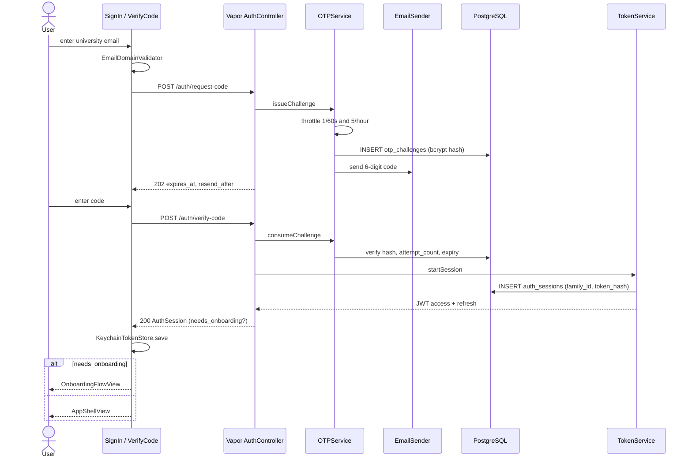
```mermaid
sequenceDiagram
    actor User
    participant App as SignIn / VerifyCode
    participant API as Vapor AuthController
    participant OTP as OTPService
    participant Mail as EmailSender
    participant DB as PostgreSQL
    participant Tokens as TokenService

    User->>App: enter university email
    App->>App: EmailDomainValidator
    App->>API: POST /auth/request-code
    API->>OTP: issueChallenge
    OTP->>OTP: throttle 1/60s and 5/hour
    OTP->>DB: INSERT otp_challenges (bcrypt hash)
    OTP->>Mail: send 6-digit code
    API-->>App: 202 expires_at, resend_after
    User->>App: enter code
    App->>API: POST /auth/verify-code
    API->>OTP: consumeChallenge
    OTP->>DB: verify hash, attempt_count, expiry
    API->>Tokens: startSession
    Tokens->>DB: INSERT auth_sessions (family_id, token_hash)
    Tokens-->>API: JWT access + refresh
    API-->>App: 200 AuthSession (needs_onboarding?)
    App->>App: KeychainTokenStore.save
    alt needs_onboarding
        App-->>User: OnboardingFlowView
    else
        App-->>User: AppShellView
    end
```

*Figure 3.8 Sequence — post creation with on-device alt text*

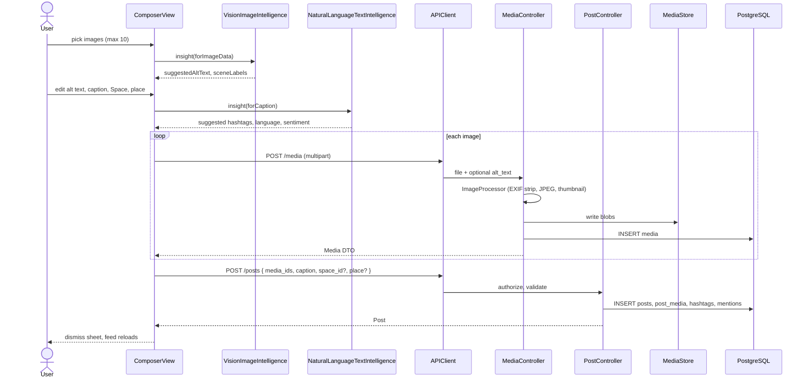
```mermaid
sequenceDiagram
    actor User
    participant Composer as ComposerView
    participant Vision as VisionImageIntelligence
    participant NL as NaturalLanguageTextIntelligence
    participant API as APIClient
    participant Media as MediaController
    participant Posts as PostController
    participant Store as MediaStore
    participant DB as PostgreSQL

    User->>Composer: pick images (max 10)
    Composer->>Vision: insight(forImageData)
    Vision-->>Composer: suggestedAltText, sceneLabels
    User->>Composer: edit alt text, caption, Space, place
    Composer->>NL: insight(forCaption)
    NL-->>Composer: suggested hashtags, language, sentiment
    loop each image
        Composer->>API: POST /media (multipart)
        API->>Media: file + optional alt_text
        Media->>Media: ImageProcessor (EXIF strip, JPEG, thumbnail)
        Media->>Store: write blobs
        Media->>DB: INSERT media
        Media-->>Composer: Media DTO
    end
    Composer->>API: POST /posts { media_ids, caption, space_id?, place? }
    API->>Posts: authorize, validate
    Posts->>DB: INSERT posts, post_media, hashtags, mentions
    Posts-->>Composer: Post
    Composer-->>User: dismiss sheet, feed reloads
```

Vision never receives a network client. The image bytes used for classification are the local picker data. The bytes that later go to `POST /media` are the upload, processed on the server into JPEG without EXIF. Those are two different copies of the photo, and only the second leaves the device.

*Figure 3.9 Sequence — realtime message delivery over WebSocket*

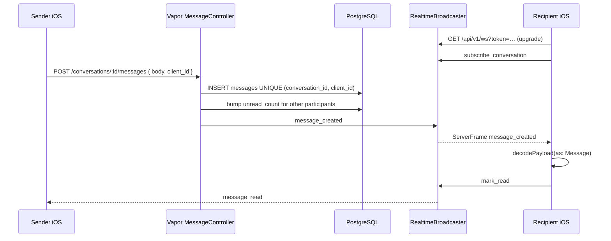
```mermaid
sequenceDiagram
    participant A as Sender iOS
    participant S as Vapor MessageController
    participant DB as PostgreSQL
    participant RT as RealtimeBroadcaster
    participant B as Recipient iOS

    B->>RT: GET /api/v1/ws?token=… (upgrade)
    B->>RT: subscribe_conversation
    A->>S: POST /conversations/:id/messages { body, client_id }
    S->>DB: INSERT messages UNIQUE (conversation_id, client_id)
    S->>DB: bump unread_count for other participants
    S->>RT: message_created
    RT-->>B: ServerFrame message_created
    B->>B: decodePayload(as: Message)
    B->>RT: mark_read
    RT-->>A: message_read
```

The `client_id` is the offline outbox key. A retry with the same id returns the original row instead of a duplicate. Any gap after a disconnect is reconciled by refetching over REST; the socket is not a source of truth.

3.7 ## **Activity and communication** {#activity-and-communication}

*Figure 3.10 Activity — feed load with offline fallback*

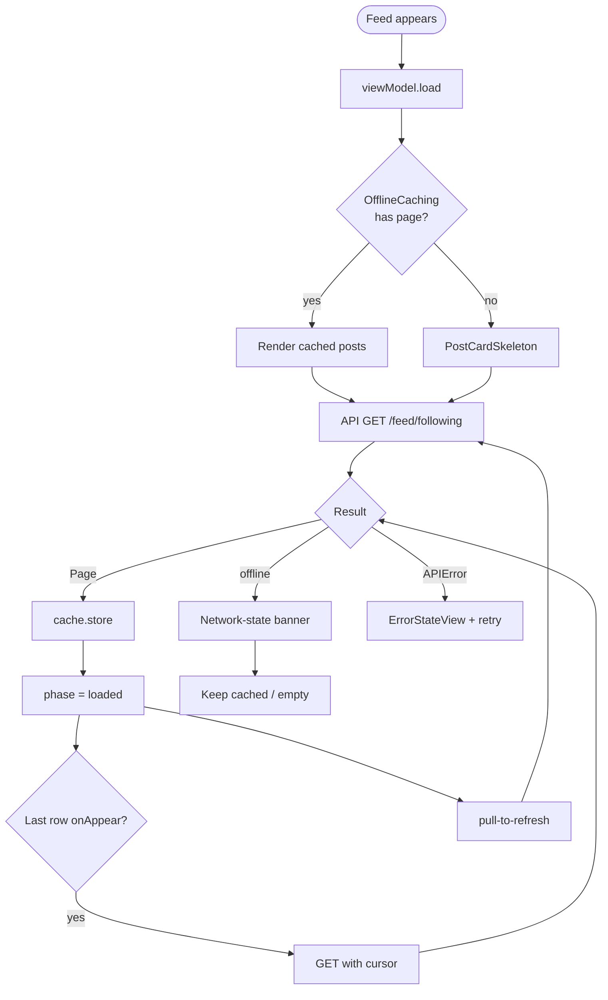
```mermaid
flowchart TD
    Start([Feed appears]) --> Task[viewModel.load]
    Task --> Cache{OfflineCaching<br/>has page?}
    Cache -->|yes| ShowCached[Render cached posts]
    Cache -->|no| Skeleton[PostCardSkeleton]
    ShowCached --> Network
    Skeleton --> Network[API GET /feed/following]
    Network --> Result{Result}
    Result -->|Page| Store[cache.store]
    Store --> Loaded[phase = loaded]
    Result -->|offline| Banner[Network-state banner]
    Banner --> Keep[Keep cached / empty]
    Result -->|APIError| Error[ErrorStateView + retry]
    Loaded --> AppearLast{Last row onAppear?}
    AppearLast -->|yes| Next[GET with cursor]
    Next --> Result
    Loaded --> Pull[pull-to-refresh]
    Pull --> Network
```

The shipped cache is `FileSystemOfflineCache`, a JSON-on-disk actor behind the `OfflineCaching` protocol. The architecture document states that the offline-first team replaces that implementation with SwiftData plus a durable outbox; callers depend only on the protocol. Message send already has an in-memory outbox keyed by `client_id` (see §4.5). A SwiftData-backed outbox for posts, likes and comments is specified (FR-17) and is not a separate persistence module in the tree.

The communication diagram for a like is the same objects as the sequence, numbered:

1. `PostCard` → `FeedViewModel.like(post)`  
2. `FeedViewModel` → optimistic `viewer.hasLiked` / `counts.likes`  
3. `FeedViewModel` → `APIClient.send(PostLike)`  
4. `APIClient` → `POST /posts/:id/like`  
5. `PostController` → `PostService`  
6. `PostService` → `INSERT post_likes` (unique pair)  
7. Trigger `post_likes_counts` → `posts.like_count`  
8. `NotificationService.raise(.like, …)`  
9. `RealtimeBroadcaster` → `notification_created` to the author  

If step 4 returns an error, the view model rolls the optimistic state back and presents `PresentedError` with retry when `APIError.isRetryable`.

3.8 ## **Component and navigation design** {#component-and-navigation-design}

*Figure 3.11 Component / package diagram*

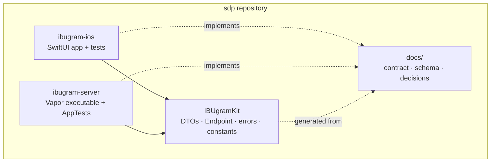
```mermaid
flowchart TB
    subgraph Repo [sdp repository]
        Kit[IBUgramKit<br/>DTOs · Endpoint · errors · constants]
        iOS[ibugram-ios<br/>SwiftUI app + tests]
        Server[ibugram-server<br/>Vapor executable + AppTests]
        Docs[docs/<br/>contract · schema · decisions]
    end

    iOS --> Kit
    Server --> Kit
    iOS -.->|implements| Docs
    Server -.->|implements| Docs
    Kit -.->|generated from| Docs
```

The iOS app is one Xcode project (`objectVersion` 77, synchronized file groups) with three targets: `ibugram`, `ibugramTests`, `ibugramUITests`. The server is a Swift package depending on Vapor, Fluent, FluentPostgresDriver, JWT and `IBUgramKit`. Feature teams do not invent navigation. One `Route` enum is the vocabulary; one `Router` per tab holds `path: [Route]`; one `RouteDestinationView` switch maps cases to views.

*Table 3.1 Client navigation routes*

| Case | Screen |
| --- | --- |
| `profile(username:)` | Profile |
| `followers` / `following` | Graph lists |
| `post(id:)` | Post detail |
| `postComments` / `postLikes` | Thread / likers |
| `hashtag(tag:)` | Hashtag timeline |
| `space(slug:)` / `spaceMembers` | Space detail / members |
| `event(id:)` / `eventAttendees` | Event detail / attendees |
| `campusMap` | MapKit campus map |
| `conversation(id:)` / `messageRequests` | Thread / requests |
| `savedPosts` | Saved tab |
| `settings`, `editProfile`, `changeUsername`, `blockedAccounts`, `activeSessions` | Settings cluster |

Modals are not routes. The Create tab is a button: selecting it restores the previous tab and sets `isPresentingComposer` on `AppShellView`.

*Figure 3.12 Navigation map*

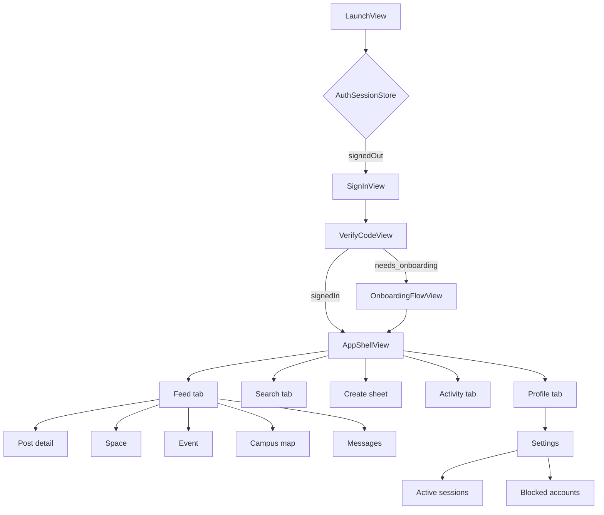
```mermaid
flowchart TB
    Launch[LaunchView] --> Root{AuthSessionStore}
    Root -->|signedOut| SignIn[SignInView]
    SignIn --> Verify[VerifyCodeView]
    Verify -->|needs_onboarding| Onboard[OnboardingFlowView]
    Verify -->|signedIn| Shell[AppShellView]
    Onboard --> Shell

    Shell --> Feed[Feed tab]
    Shell --> Search[Search tab]
    Shell --> Create[Create sheet]
    Shell --> Activity[Activity tab]
    Shell --> Profile[Profile tab]

    Feed --> Post[Post detail]
    Feed --> Space[Space]
    Feed --> Event[Event]
    Feed --> Map[Campus map]
    Feed --> DM[Messages]
    Profile --> Settings[Settings]
    Settings --> Sessions[Active sessions]
    Settings --> Blocked[Blocked accounts]
```

3.9 ## **API design rationale** {#api-design-rationale}

The contract (`docs/01-API-CONTRACT.md` plus three amendments on 2026-09-20) is frozen. Server and client teams do not negotiate; they implement the document. Three design choices are worth defending.

**Cursor pagination, not offsets.** List endpoints take `?limit=20&cursor=` and return `{ items, next_cursor }`. Offset pagination is unstable under inserts: a new post at the top of the Following feed shifts every subsequent page, so a client that asks for `offset=20` after a refresh double-sees or skips. Keyset cursors are stable. Discover ranking (decision D-005) is even less offset-friendly, because the cursor is against the ranked row, not against `created_at` alone.

The Discover score is:

`score = exp(−age_hours / 36) × (1 + ln(1 + likes) + 1.6 ln(1 + comments)) × department_boost`

Department boost is 1.3 when author and viewer share a department, else 1.0. Tie-break is `created_at DESC`, then `id DESC`. A 36-hour half-life matches campus checking cadence. Comments outrank likes because they take more effort. Same-department affinity is the university-specific signal a generic clone would not have. Collaborative filtering was given up because it needs production traffic this project does not have.

**A shared DTO package.** `IBUgramKit` is compiled into both binaries. Wire keys are `snake_case`; Swift properties are `camelCase` via a shared coding strategy. Error codes, OTP constants, allowed domains, page-size limits and endpoint path templates live in one module. The alternative is two handwritten copies of `Post` and a weekly integration bug. The cost of the package showed up anyway: four iOS feature teams defined local DTOs before the kit compiled, and the feed card could not render Space, Event or location chips. Amendment 2.3 made those fields mandatory. The later unification commit deleted the duplicates.

**The error envelope.** Every non-2xx response is `{ error: { code, message, details } }`. `code` is stable and machine-readable. The client maps it to localized copy and never displays `message` verbatim except as a fallback for an unrecognized code. Clients branch on `code`, never on status alone; Amendment 1 then pinned the status mapping so logs and tests still have a numeric handle.

*Table 3.2 Canonical API error codes and HTTP statuses*

| Code | Status |
| --- | --- |
| `validation_failed` | 422 |
| `otp_invalid`, `otp_expired` | 400 |
| `unauthorized` | 401 |
| `forbidden`, `domain_not_allowed` | 403 |
| `not_found` | 404 |
| `username_taken`, `conflict` | 409 |
| `payload_too_large` | 413 |
| `otp_throttled`, `rate_limited` | 429 |
| `not_implemented` | 501 |
| `internal_error` | 500 |

`not_implemented` marks a registered but unfinished route and carries `details.endpoint`. It exists so a client that hits a gap gets a typed error rather than a generic 500.

3.10 ## **Security design** {#security-design}

**OTP hashing.** The plaintext code exists in memory long enough to send, and in the development log / `debug_code` field. The row stores a Bcrypt hash. Verification uses `Bcrypt.verify`. Attempt count dies at 5; expiry is 10 minutes; issuance is throttled to one per 60 seconds and five per hour per address. Outstanding challenges are consumed when a new one is issued, so only the latest code is live.

**Token rotation.** Access tokens are JWTs (HMAC-SHA256) with a 15-minute lifetime. Claims include `sub`, `exp`, `iat`, `jti` (the `auth_sessions.id`), `sfm` (session family) and `role`. Refresh tokens are opaque, stored as SHA-256 hashes, valid 60 days, and rotated on every use. Rotation inserts a new row and marks the old one `revoked_reason = rotated`, so the table is an append-only audit trail. Presenting a token whose row is already `rotated` means two holders have the same token: the whole family is revoked with `reuse_detected`. The authenticator also requires the family to still have a live row, so logout is immediate.

**Domain enforcement.** `IBUgram.allowedEmailDomains` is the single allow-list. The client validates before enabling "Send me a code"; the server rejects `domain_not_allowed` regardless. Role is derived from the domain, not from a form field.

**Media.** Uploads are capped at 10 MB, accepted as JPEG/PNG/HEIC, re-encoded to JPEG through ImageIO so EXIF (including GPS) is not copied into the stored file, and served as a processed rendition plus a thumbnail.

**Authorization.** Every route is authenticated unless it is on the documented public list (`request-code`, `verify-code`, `refresh`, health, username availability). Suspended accounts fail the authenticator. Faculty-only official Spaces return 403. Capacity RSVP uses `SELECT … FOR UPDATE` so two concurrent `going` requests cannot both succeed at the last seat.

**Rate limiting.** Auth routes have a dedicated limiter. OTP throttling is a second, tighter limit keyed on email.

**Known gaps**, recorded so Chapter 6 does not have to pretend they are closed: APNs is not delivered; TLS is a deployment concern (development is plaintext localhost); the development `debug_code` must not ship; `conversation_participants.unread_count` is application-maintained rather than trigger-maintained; WidgetKit/App Intents are unspecified from a privacy standpoint because they are unimplemented.

*Table 3.3 Foreign-key delete behaviour (summary)*

| Relationship | Rule | Why |
| --- | --- | --- |
| Account → sessions, posts, comments, likes, follows, messages, notifications | CASCADE | Deleting an account must remove that person's contributions. Anything left is a privacy problem. |
| Account → `spaces.created_by_id`, group `conversations.created_by_id`, `reports.handled_by_id` | SET NULL | Provenance, not ownership. A club outlives its founder. |
| Account → `events.host_id` | CASCADE | A hostless event has no one to answer for it. |
| Space / event / place → posts | SET NULL | A post survives its tag being removed. Cascading would silently destroy user content. |
| Post → media blobs | none (join row cascades) | Blob deletion is a retryable background job so a failed unlink cannot fail a user's delete. |

*Table 3.4 Trigger-maintained counters*

| Trigger | Maintains |
| --- | --- |
| `post_likes_counts` | `posts.like_count` |
| `comment_likes_counts` | `comments.like_count` |
| `comments_counts` | `posts.comment_count`, `comments.reply_count` |
| `posts_counts` | `users.post_count` |
| `follows_counts` | `users.follower_count`, `users.following_count` |
| `post_hashtags_counts` | `hashtags.post_count` |
| `space_memberships_counts` | `spaces.member_count` (role ≠ pending) |
| `event_rsvps_counts` | `events.going_count`, `events.interested_count` |

Counters live in PostgreSQL triggers, not in Swift, because cascades and `psql` deletes never pass through the service layer. Decrements use `GREATEST(x - 1, 0)`. Membership and RSVP counters recompute on UPDATE because a status change is not an insert.

4. # **IMPLEMENTATION** {#implementation}

4.1 ## **Languages, frameworks and justification** {#languages-frameworks-and-justification}

*Table 4.1 Languages and frameworks*

| Technology | Role | Justification |
| --- | --- | --- |
| Swift 6 | Client and server language | Strict concurrency; one language across the stack (D-001, D-003). |
| SwiftUI | User interface | Current native UI; Dynamic Type and dark mode through the design system. |
| Swift Testing | Unit and integration tests | `@Test` / `#expect`; XCTest retained only for UI tests. |
| Vapor 4 | HTTP + WebSocket server | Swift server, first-class async, testable with `VaporTesting`. |
| Fluent | ORM and migrations | 34 reversible migrations matching the ER model. |
| PostgreSQL 14 | System of record | Constraints, GIN full-text, `SELECT … FOR UPDATE`, triggers. |
| JWT (Vapor JWT 5) | Access tokens | HMAC-SHA256, family claim for revocation. |
| `URLSession` | Client HTTP | Wrapped in an `actor` so refresh coalescing is data-race free. |
| Keychain | Token storage | `kSecAttrAccessibleAfterFirstUnlockThisDeviceOnly`. Tokens never touch `UserDefaults`. |
| Vision | On-device image labels | `VNClassifyImageRequest`; alt-text suggestion at compose time. |
| Natural Language | Caption intelligence | Hashtags from lexical class, `NLLanguageRecognizer`, sentiment score. |
| MapKit | Campus map | Pins from `GET /events/map?bbox=`. |
| EventKit | Add to Calendar | Write-only access; used on the event detail screen. |
| LocalAuthentication | Optional app lock | Settings toggle; `Info.plist` usage string for Face ID. |
| WidgetKit / App Intents | Specified P1 extensions | Not present as source files in this repository. |
| SwiftData | Specified cache/outbox | Callers use `OfflineCaching`; shipped implementation is JSON-on-disk. |

The author's prior stack was Android and React Native. The justification for SwiftUI over a cross-platform client is the personal objective in §1.2: this project is the native iOS education. The justification for Vapor over a Node or Go API is D-001: the shared kit only pays for itself if both sides compile Swift.

4.2 ## **Environment and how to run the system** {#environment-and-how-to-run-the-system}

**Hardware / software used for development.** macOS (Darwin), Xcode with the iOS simulator destination `platform=iOS Simulator,name=iPhone 17 Pro,OS=26.3.1`, PostgreSQL on localhost, Swift 6.0 toolchain. The iOS deployment target is 18.0; the device family is iPhone, portrait only. The server platform in `Package.swift` is macOS 14.

**Server.** Copy `ibugram-server/.env.example` to `.env`. Defaults talk to `127.0.0.1:5432` as user `sead`, database `ibugram_dev`, JWT secret a development placeholder, media directory `.media`, public base URL `http://127.0.0.1:8080`. Create the database, then:

```
cd ibugram-server
swift run App migrate
swift run App serve
```

The API listens on port 8080. `GET /health` (also `GET /api/v1/health`) returns `{ status, database, version }` without authentication. Tests use database `ibugram_test` (see `TestSupport`).

**Client.** Open `ibugram-ios/ibugram.xcodeproj`, scheme `ibugram`. Build:

```
xcodebuild -project ibugram.xcodeproj -scheme ibugram \
  -destination 'platform=iOS Simulator,name=iPhone 17 Pro,OS=26.3.1' build
```

The `OS=` component is required. Without it `xcodebuild` resolves `OS:latest` (iOS 27.0 in this environment), which has no iPhone 17 Pro device.

To run the app without a server:

```
xcrun simctl launch <udid> ba.ibu.ibugram \
  -ibugram-mock-api YES -ibugram-auth-state signed-in
```

That is how UI tests and the populated screenshots run. Full commands are repeated in Appendix D.

4.3 ## **The shared IBUgramKit package** {#the-shared-ibugramkit-package}

`IBUgramKit` is a Swift package with platforms iOS 18 and macOS 14, language mode 6. It has no third-party dependencies. The server and the Xcode project both reference it as a local package (`../IBUgramKit`).

What it contains:

- Constants: allowed domains, `/api/v1`, OTP digit count, lifetimes, page sizes, max upload bytes, max media per post.
- `Endpoint` values for every route, with path-parameter substitution.
- Request and response DTOs (`User`, `Post`, `Space`, `Event`, `Message`, `AuthSession`, …).
- `APIError` / `APIErrorEnvelope` / `APIErrorCode`.
- JSON coding (`snake_case`, ISO-8601 fractional seconds).
- Pagination envelope `Page`.
- WebSocket frame types.

What it buys:

1. **A single source of truth.** If the contract adds a field, it is added once. The alternative was observed in progress notes: local `Post` types that omitted `space`, `event` and `location`, so the feed card could not render chips.
2. **Compile-time coupling.** The server registers routes with `app.on(API.someEndpoint, use:)`. The client builds URLs from the same path templates (and from typed `Endpoint` wrappers that reference kit DTOs). A renamed path is a failed compile, not a 404 in production.
3. **Identical error vocabulary.** The client `APIError` maps envelope codes one-to-one with the kit enum.
4. **Testable constants.** `IdentityTests` asserts `IBUgram.allowedEmailDomains == ["ibu.edu.ba", "stu.ibu.edu.ba"]`. Domain policy is not a string copied into a view.

The package is not a networking stack. `APIClient` stays in the app because token storage, refresh coalescing and multipart encoding are client concerns. The kit describes the wire; the actor implements it.

Amendments 1–3 to the contract were ratified after foundation work. A1.4 added username availability, media thumbnails and reports. A2 pinned search and notification body shapes the client had already assumed. A3 recorded that `Event.postId` is derived (oldest post with that `event_id`) because the `events` table has no `post_id` column, and that `IBUgramKit.ReportBody` briefly disagreed with `POST /reports` until aligned. Those notes are part of the engineering record, not errata to hide.

4.4 ## **Feature walkthrough** {#feature-walkthrough}

Screenshots live in `docs/screenshots/`. Two series exist and must not be confused.

The `01`–`06` series was captured during iOS foundation: sign-in, dark sign-in, the tab shell while feature modules were still placeholders, onboarding, and OTP verification. Figure 4.5 still shows the placeholder Feed tab ("Owned by Feed & Posts") and is included because it documents the shell that later screens replace.

The `1x-*` series was captured later by `ScreenshotCaptureUITests` into the same directory, in light and dark, after the client was unified on `IBUgramKit` and the feed, composer, profile, search, activity, messages, Spaces, Events and map were wired. Fixture copy in those shots is demo data (Amina Hodžić, Leila Marković, Prof. Dr. Damir Kovač, IBU Robotics, Robotics open lab). Image pixels are blurred placeholders, which is what the screenshot harness recorded.

*Table 4.2 Screenshots embedded in Chapter 4*

| File | Feature |
| --- | --- |
| `01-ios-sign-in-light.png` / `02-ios-sign-in-dark.png` | Sign in |
| `06-ios-verify-code-light.png` | OTP entry (light only in the capture set) |
| `05-ios-onboarding-light.png` | Profile setup (light only in the capture set) |
| `03-ios-tab-shell-light.png` / `04-ios-tab-shell-dark.png` | Foundation tab shell (placeholder) |
| `1x-feed-light.png` / `1x-feed-dark.png` | Following feed |
| `1x-composer-light.png` / `1x-composer-dark.png` | New post |
| `1x-post-detail-light.png` / `1x-post-detail-dark.png` | Comments |
| `1x-profile-light.png` / `1x-profile-dark.png` | Profile |
| `1x-search-idle-light.png` / `1x-search-idle-dark.png` | Search idle |
| `1x-activity-light.png` / `1x-activity-dark.png` | Notifications |
| `1x-messages-light.png` / `1x-messages-dark.png` | Inbox |
| `1x-space-light.png` / `1x-space-dark.png` | Space |
| `1x-event-light.png` / `1x-event-dark.png` | Event + RSVP |
| `1x-map-light.png` / `1x-map-dark.png` | Campus map |

All twenty-six files in `docs/screenshots/` are embedded below. Onboarding and OTP verification were captured in light appearance only.

### 4.4.1 Identity and access

*Figure 4.1 Sign in (light)*

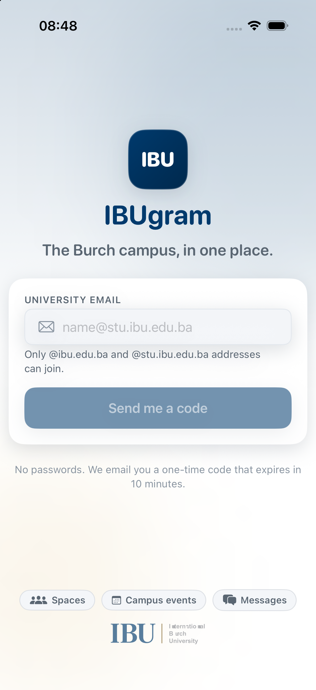

The unauthenticated screen states the membership rule in the field caption: only `@ibu.edu.ba` and `@stu.ibu.edu.ba` addresses can join. The primary button stays disabled until `EmailDomainValidator` returns `.allowed`. Footer copy states that there are no passwords and that the code expires in 10 minutes, which matches `IBUgram.otpLifetime`. Chips preview Spaces, Campus events and Messages without offering a guest path — there is no public browse.

*Figure 4.2 Sign in (dark)*

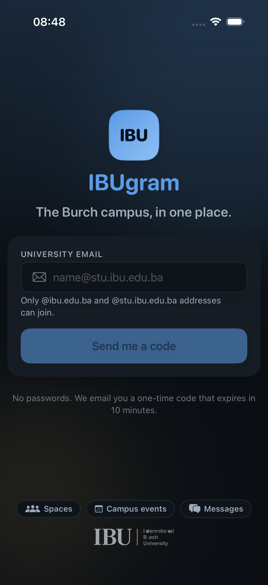

Dark mode is not an invert. Brand navy `#003A6D` lifts to `#5B9BE5` on `#0B0F14` so the mark stays legible. Colour assets are 19 sets with explicit light and dark appearances.

*Figure 4.3 OTP verification (light)*

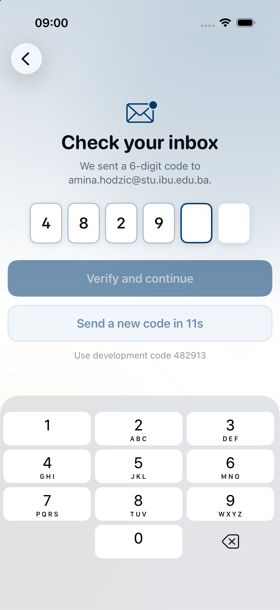

`OneTimeCodeField` is six boxed digits over one hidden field so paste, autofill and `.oneTimeCode` work. The development build surfaces "Use development code 482913" because the mock/API development path exposes `debug_code`; that affordance is absent in production. Resend is time-gated (`otpResendInterval = 60`). Verify stays disabled until six digits are present.

*Figure 4.4 Onboarding (light)*

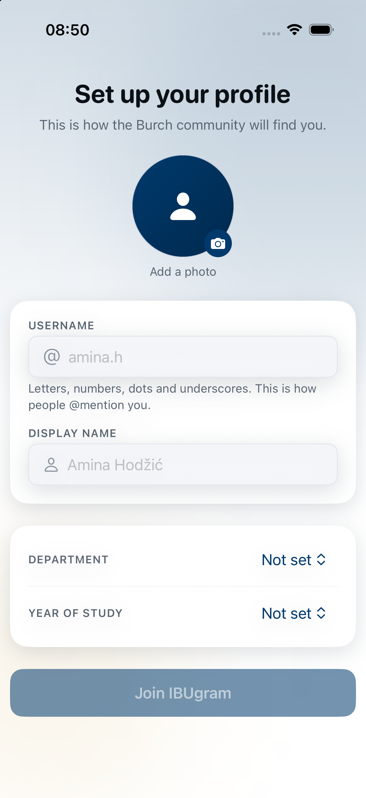

Onboarding collects username, display name, optional avatar, department and year of study. Helper text for the username explains mention syntax. `needs_onboarding` is the only completion signal (Amendment 1.3): the server may already have assigned a placeholder `user_<prefix>` username, so a populated `User.username` does not mean the student finished this screen.

Settings, not pictured, lists active sessions (revocable), an optional biometric app lock via LocalAuthentication, appearance (system / light / dark), blocked accounts, and sign out. Tokens remain in the Keychain across those actions until logout rotates and revokes the family.

### 4.4.2 Application shell

*Figure 4.5 Early tab shell (light)*

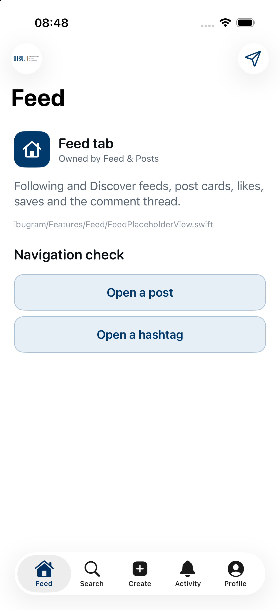

Five tabs — Feed, Search, Create, Activity, Profile — were in place before feature teams replaced the placeholders. The Create tab is still not a destination: it presents the composer sheet and restores the previous tab. A paper-plane button in the feed header opens Messages.

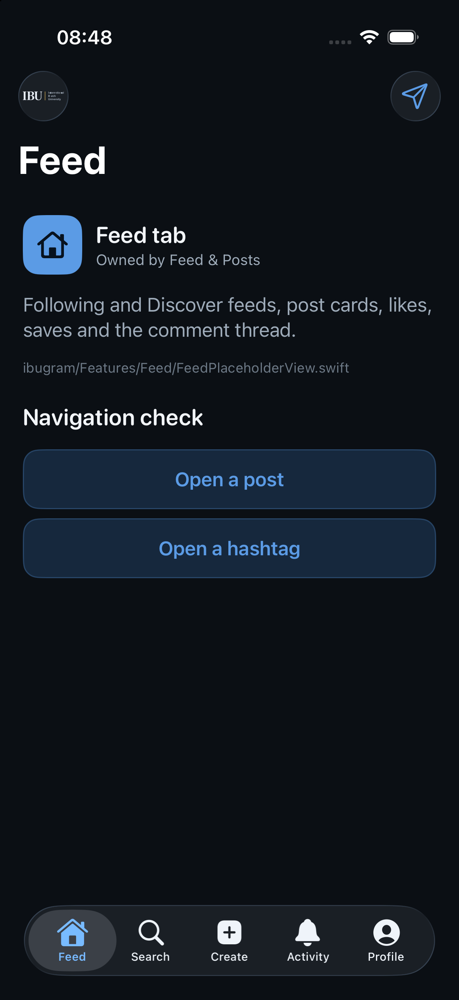

*Figure 4.5b Early tab shell (dark)*

### 4.4.3 Feed and posts

*Figure 4.6 Following feed with Happening now (light)*

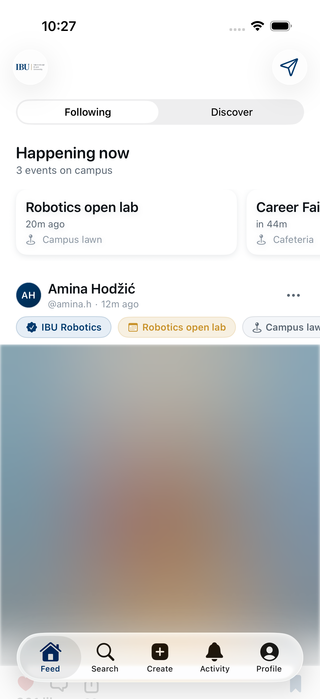

The Following / Discover segmented control is the two-feed requirement. "Happening now" is the Events rail (`GET /events/happening-now`): Robotics open lab on the campus lawn, Career Fair in the cafeteria. The post card shows author, relative time, and the three context chips Amendment 2.3 made mandatory — Space (IBU Robotics), Event (Robotics open lab), location (Campus lawn). The media area is a blurred placeholder in the demo dataset. The tab bar is the same shell as Figure 4.5, now filled.

*Figure 4.7 Following feed (dark)*

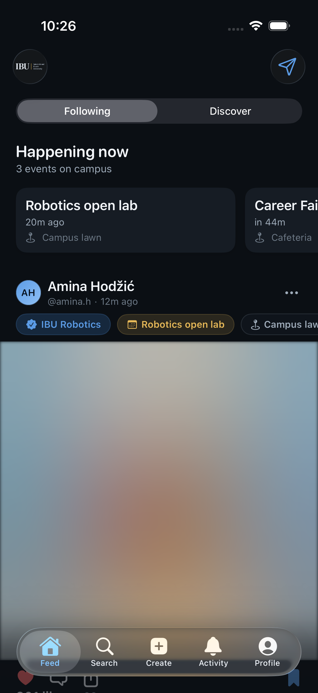

*Figure 4.8 Post composer (light)*

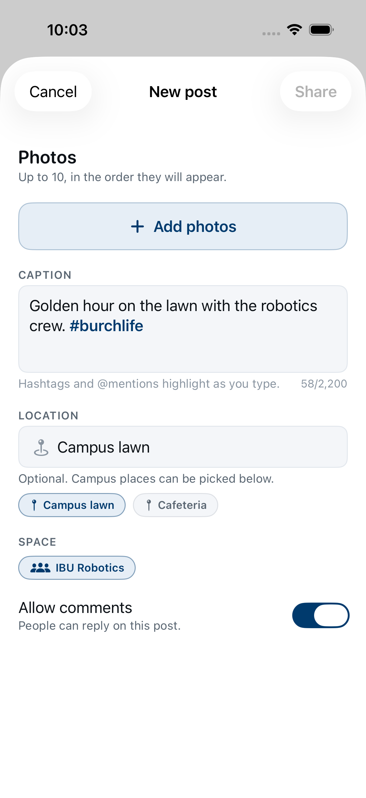

The composer is a sheet. Photos: up to 10, in carousel order (enforced in the schema by `UNIQUE (post_id, position)`). Caption with a 2,200-character counter and live hashtag highlighting (`#burchlife`). Optional location chips for campus places. Optional Space. Comments can be disabled. Share remains the mutating action; Cancel dismisses.

*Figure 4.9 Post composer (dark)*

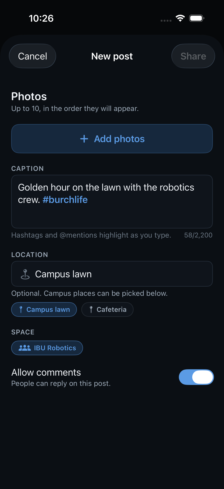

On-device intelligence is a compose-time service, not a separate screen. `VisionImageIntelligence` classifies picker data with `VNClassifyImageRequest` (confidence ≥ 0.25, up to four labels) and builds an editable sentence of the form "A photo of {first}, showing {rest}." `NaturalLanguageTextIntelligence` proposes hashtags from nouns and names, identifies language, and records a sentiment score. Neither type holds an `APIClient`.

*Figure 4.10 Post detail and comments (light)*

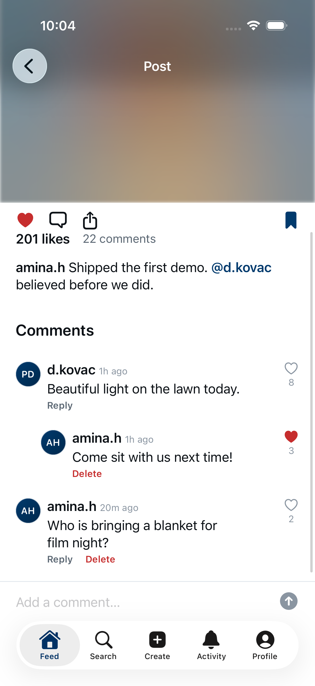

The detail screen is the comment thread: one level of replies, comment likes, author-only Delete, and a composer at the bottom. Caption mentions (`@d.kovac`) are linkified. Like and save sit on the action row.

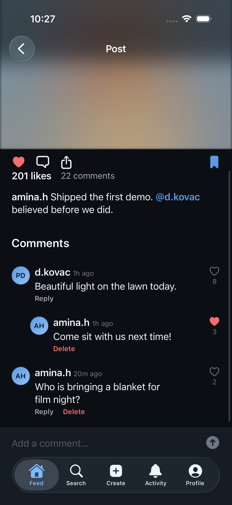

*Figure 4.10b Post detail and comments (dark)*

### 4.4.4 Profiles and social graph

*Figure 4.11 Profile (light)*

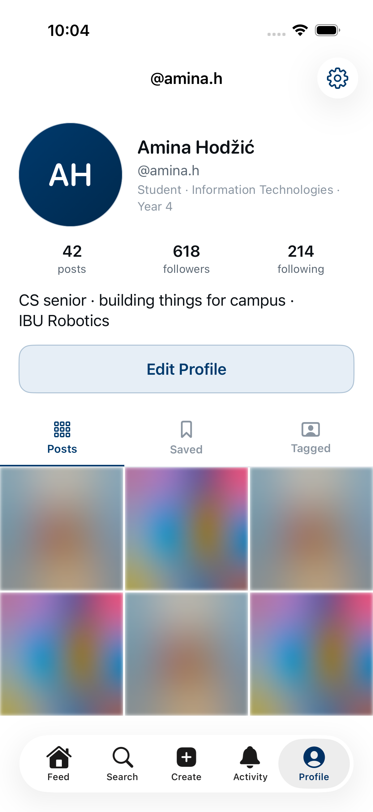

Self profile for `@amina.h`: avatar initials, display name, Student · Information Technologies · Year 4, trigger-maintained counts (42 / 618 / 214 in the fixture), bio, Edit Profile, and Posts / Saved / Tagged tabs. Settings is the gear. A non-self profile replaces Edit Profile with Follow and omits Saved.

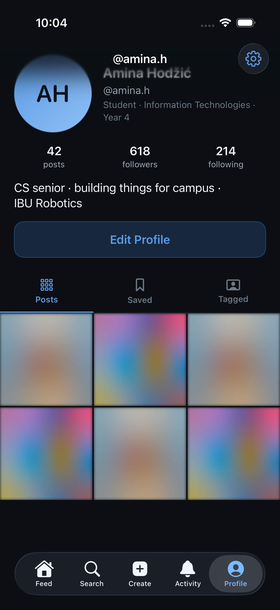

*Figure 4.11b Profile (dark)*

### 4.4.5 Search and activity

*Figure 4.12 Search idle (light)*

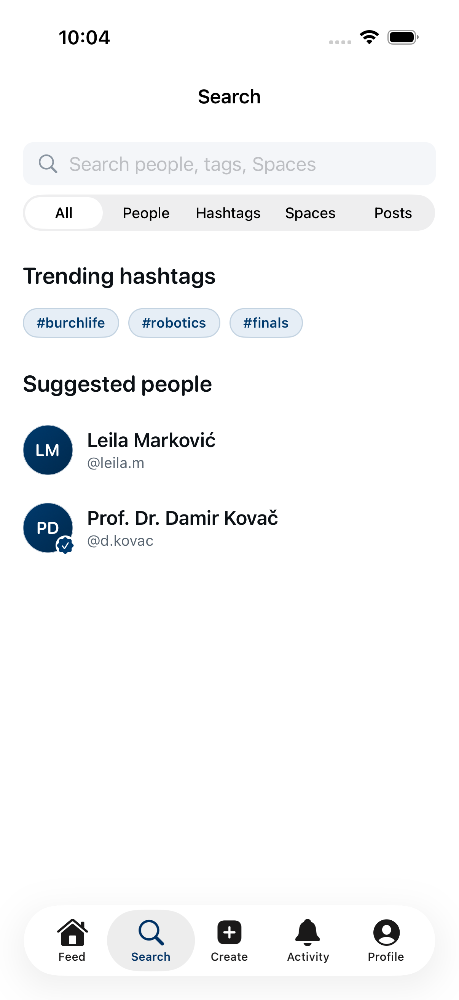

Idle search shows trending hashtags (`#burchlife`, `#robotics`, `#finals`) and suggested people from the department, including a faculty row with the verified badge. Type filters: All, People, Hashtags, Spaces, Posts. The query hits `GET /search` and PostgreSQL `simple` full-text vectors on users and captions.

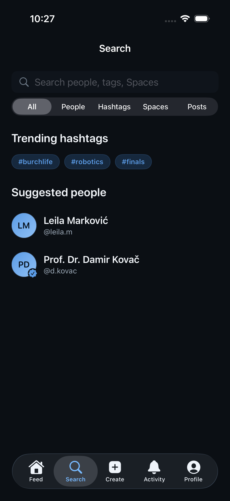

*Figure 4.12b Search idle (dark)*

*Figure 4.13 Activity (light)*

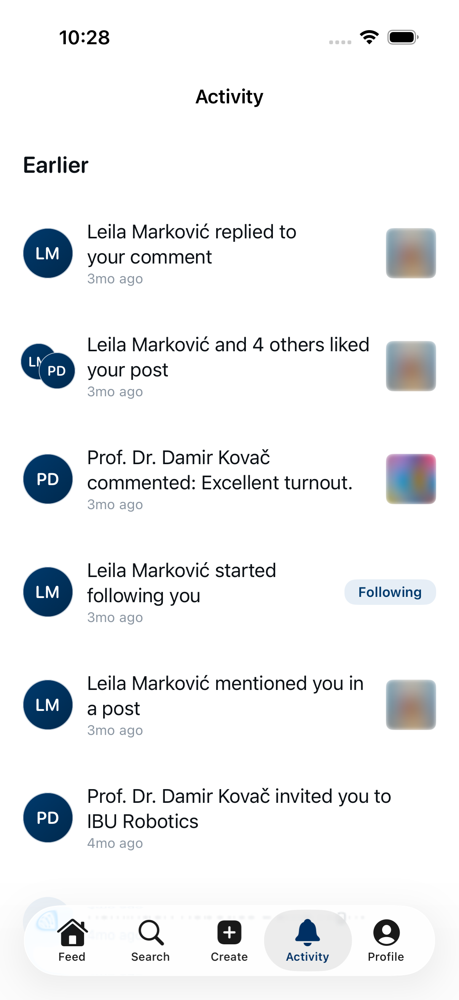

Grouped notifications match the `UNIQUE (recipient_id, group_key)` design: "Leila Marković and 4 others liked your post" is one row with `group_count`. Kinds visible in the fixture: reply, like, comment, follow, mention, Space invite. The Activity tab badge is `ActivityBadgeStore.unreadCount`.

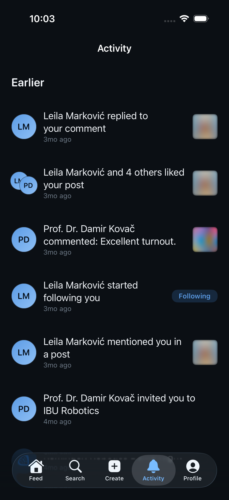

*Figure 4.13b Activity (dark)*

### 4.4.6 Direct messaging

*Figure 4.14 Messages inbox (light)*

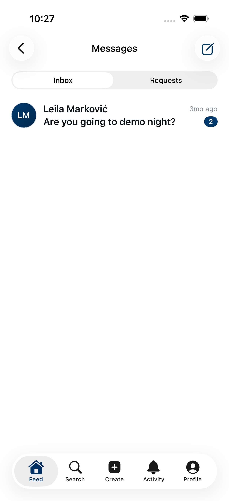

Inbox / Requests matches `GET /conversations?filter=inbox|requests`. Unread badge (2) is per participant. Compose is the trailing button. Threads send over REST with `client_id` and receive `message_created` on the socket.

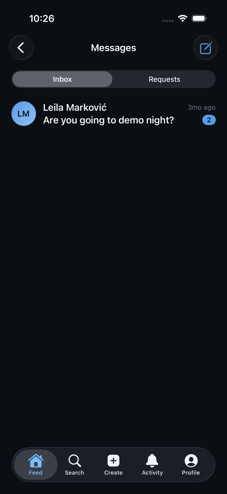

*Figure 4.14b Messages inbox (dark)*

### 4.4.7 Spaces

*Figure 4.15 Space — IBU Robotics (light)*

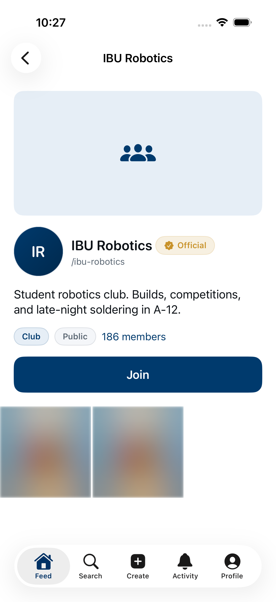

IBU Robotics is an official, public club (`is_official`, kind Club, visibility Public) with a member count maintained by trigger, a Join button, and a Space feed. Faculty-only creation of official Spaces is a server 403, not merely a hidden button.

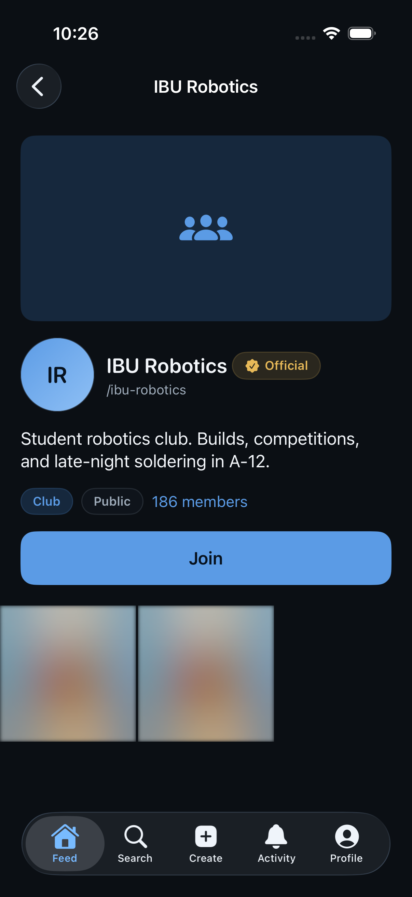

*Figure 4.15b Space — IBU Robotics (dark)*

### 4.4.8 Campus Events and map

*Figure 4.16 Event — Robotics open lab (light)*

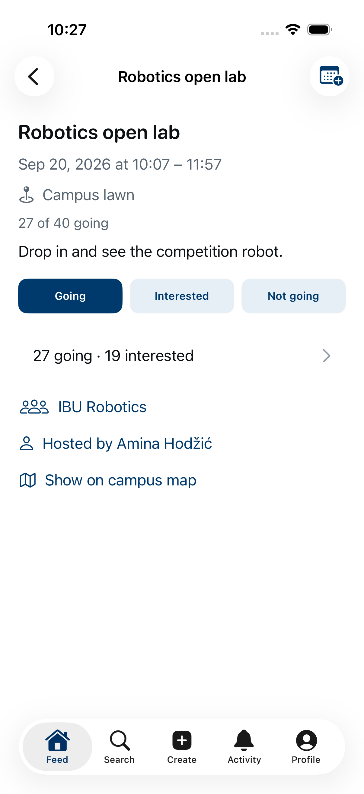

Event detail shows title, time window, campus place, capacity (27 of 40 going), description, RSVP going / interested / not going, host, affiliated Space, Show on campus map, and Add to Calendar (EventKit, trailing button). `EventKitCalendarStore` requests write-only access and saves title, notes, start, end and place name.

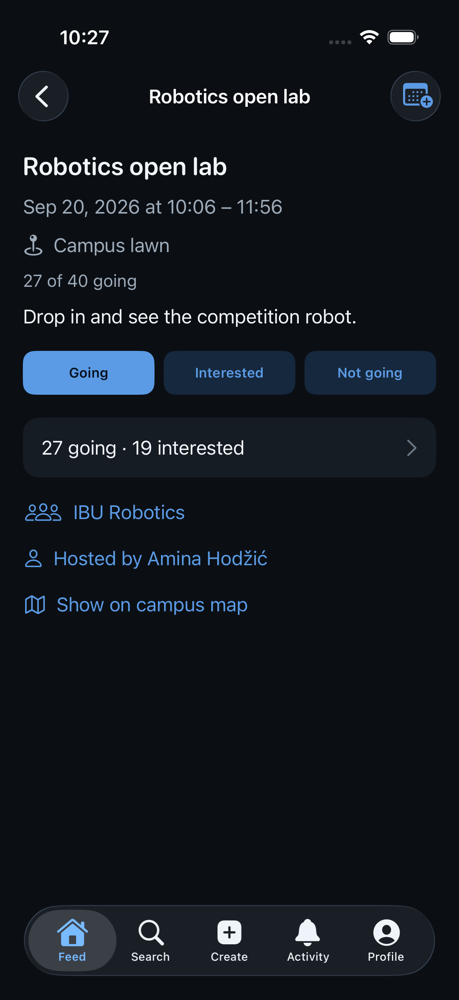

*Figure 4.16b Event — Robotics open lab (dark)*

*Figure 4.17 Campus map (light)*

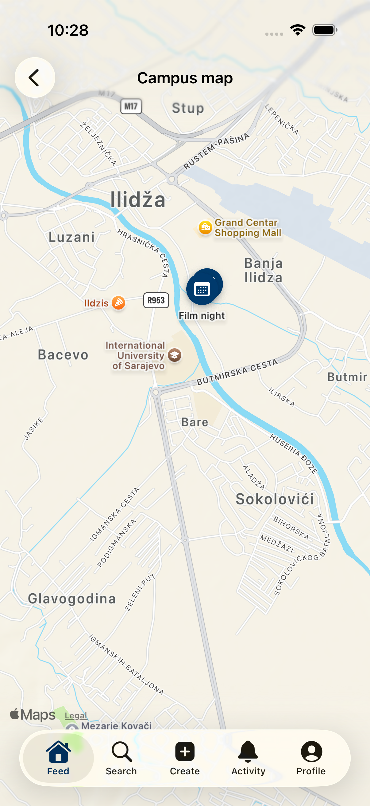

MapKit region around Ilidža / International University of Sarajevo, with an event pin ("Film night"). Data comes from `GET /events/map?bbox=`. Places store latitude and longitude; the index is a btree pair, documented as adequate at campus scale.

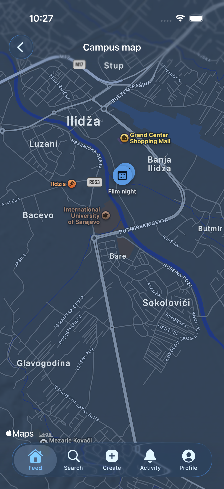

*Figure 4.17b Campus map (dark)*

4.5 ## **Selected code listings** {#selected-code-listings}

Listings are shortened. Line numbers refer to the files in this repository.

**Refresh coalescing in `APIClient`.** Concurrent 401s must not rotate the refresh token twice. The first caller creates a `Task`; everyone else awaits it. Failure invalidates the session.

```109:121:ibugram-ios/ibugram/Networking/APIClient.swift
    /// Concurrent 401s collapse onto a single refresh: the first caller creates the task,
    /// everyone else awaits its result.
    func refreshedTokens() async throws -> TokenPair {
        if let refreshInFlight { return try await refreshInFlight.value }

        let task = Task<TokenPair, Error> { [weak self] in
            guard let self else { throw APIError.unauthorized }
            return try await self.performRefresh()
        }
        refreshInFlight = task
        defer { refreshInFlight = nil }
        return try await task.value
    }
```

**OTP issuance and consumption.** The service never looks up whether the account exists. The hash is Bcrypt; plaintext is not stored.

```16:27:ibugram-server/Sources/App/Services/OTPService.swift
    /// Never returns a different shape for a known and an unknown address: the account is
    /// not looked up at all, so the response cannot distinguish them.
    func issueChallenge(
        toEmail email: String,
        clientAddress: String?,
        on database: any Database
    ) async throws -> IssuedChallenge {
        let now = Date()
        try await enforceThrottle(for: email, now: now, on: database)
        try await invalidateOutstandingChallenges(for: email, on: database)
```

```69:79:ibugram-server/Sources/App/Services/OTPService.swift
        guard try Bcrypt.verify(code, created: challenge.codeHash) else {
            challenge.attemptCount += 1
            if challenge.attemptCount >= IBUgram.otpMaxAttempts {
                challenge.consumedAt = now
            }
            try await challenge.save(on: database)
            throw APIError(code: .otpInvalid, message: "That code is not correct.")
        }

        challenge.consumedAt = now
```

**Message outbox replay.** Sends are keyed by `clientID`. Optimistic rows are upserted locally; the server unique constraint on `(conversation_id, client_id)` makes retry safe.

```24:41:ibugram-ios/ibugram/Features/Messages/ConversationThreadViewModel+Sending.swift
    func retryOutbox(clientID: UUID) async {
        guard let draft = outbox[clientID] else { return }
        await submit(draft)
    }

    func submit(_ item: MessageOutboxDraft) async {
        outbox[item.clientID] = item
        lastSentClientID = item.clientID
        isSending = true
        upsert(optimisticMessage(for: item))
        defer { isSending = false }
        do {
            let sent = try await api.send(
                ConversationEndpoints.sendMessage(
                    conversationID: conversationID,
                    body: item.body,
                    mediaIDs: item.mediaIDs.isEmpty ? nil : item.mediaIDs,
```

**Vision alt-text pipeline.** Classification is local. The comment on the protocol is the privacy claim.

```11:38:ibugram-ios/ibugram/Intelligence/ImageIntelligence.swift
/// On-device only. No image bytes leave the phone for analysis.
protocol ImageIntelligenceProviding: Sendable {
    func insight(forImageData data: Data) async throws -> ImageInsight
}

struct VisionImageIntelligence: ImageIntelligenceProviding {
    // ...
    private func classify(_ data: Data) throws -> [String] {
        let request = VNClassifyImageRequest()
        try VNImageRequestHandler(data: data).perform([request])
        let observations = request.results ?? []
        return observations
            .filter { $0.confidence >= minimumConfidence }
            .prefix(maximumLabels)
            .map { $0.identifier.replacingOccurrences(of: "_", with: " ") }
    }
```

**EXIF stripping.** Decoding through ImageIO and re-encoding from the bare `CGImage` copies no container metadata.

```19:21:ibugram-server/Sources/App/Services/ImageProcessor.swift
/// Decoding through ImageIO and re-encoding from the bare `CGImage` is what strips EXIF:
/// nothing is carried across from the source container, including GPS tags.
struct ImageProcessor: Sendable {
```

5. # **SYSTEM TESTING** {#system-testing}

5.1 ## **Strategy** {#strategy}

The test pyramid as applied here is three layers, plus a manual matrix for behaviour the automated suite does not own.

1. **Unit.** `IBUgramKit` coding, identity, errors, endpoints and realtime frames. Client view models and services against `MockAPIClient`. No network, no database.
2. **Integration.** Server `AppTests` against a real PostgreSQL database (`ibugram_test`). Every suite acquires `ExclusiveDatabaseAccess` so concurrent Swift Testing workers do not truncate each other's rows. Schema is dropped and migrated once per process, then tables are emptied per test.
3. **System / UI.** XCUITest on the simulator. Sign-in journeys hit the real UI; screenshot tests launch with `-ibugram-mock-api YES` and a signed-in fixture so they do not need the server.

Engineering standard §6 requires Swift Testing for new tests, sentence-case names, a happy path and an authorization test per endpoint, and no wall-clock sleeps. UI tests remain XCTest because XCUITest is not Swift Testing.

This chapter reports **tests present in source** (counted from `@Test` and `func test` as of the current tree) and **commands that reproduce a run**. It does not invent pass/fail totals or p95 timings. Where `docs/PROGRESS.md` recorded a dated snapshot, that snapshot is quoted as a snapshot.

5.2 ## **Unit tests** {#unit-tests}

`IBUgramKit` contains 42 `@Test` methods across five files (`CodingTests` 11, `IdentityTests` 11, `EndpointTests` 7, `APIErrorTests` 7, `RealtimeTests` 6). That count matches the 2026-09-20 09:25 progress note ("`IBUgramKit` | Shared DTO package, 42 tests").

Client unit tests live in `ibugram-ios/ibugramTests/`. There are 65 `@Test` methods:

*Table 5.1 Tests present in the repository by target*

| Target | How counted | Count |
| --- | --- | --- |
| `IBUgramKitTests` | `@Test` | 42 |
| `ibugram` unit (`ibugramTests`) | `@Test` | 65 |
| `AppTests` (server) | `@Test` | 136 |
| `ibugramUITests` | `func test…` | 8 |

Client suites cover email-domain validation, error-envelope mapping, feed view-model loading, composer, post detail, profile, search, activity, Space join, Event RSVP, map bounding boxes, and message outbox retry. Foundation tests in `ibugramTests.swift` (19 `@Test` methods) match the progress note "19 unit + 4 UI tests" for the architecture slice; the additional 46 view-model tests arrived with feature modules.

Example names (they are sentences, as required):

- "a student address is allowed and resolves to the student role"
- "A code is not issued to an address outside the university"
- "The response is the same shape whether or not the account already exists"

Reproduce:

```
cd IBUgramKit && swift test
cd ibugram-ios && xcodebuild test -project ibugram.xcodeproj -scheme ibugram \
  -destination 'platform=iOS Simulator,name=iPhone 17 Pro,OS=26.3.1' \
  -only-testing:ibugramTests
```

See Appendix C for the file-level inventory. Pass/fail output of a local run is not checked into the repository; run the commands and paste the transcript.

5.3 ## **Integration tests** {#integration-tests}

Server tests use `VaporTesting` and a real Postgres. `TestHarness` creates the application with `ibugram_test`, injects `SentCodeLog` so OTP tests can read a code without a mail server, and serialises access. `AuthTests` covers request-code success, foreign-domain rejection, existence indistinguishability, throttling, verify, expiry and attempt lockout. `SessionTests` covers refresh rotation and reuse detection. `MediaTests` covers upload processing. Feature files cover feed, posts, comments, social graph, search, Spaces (including faculty-only official), Events (including capacity), reports, conversations, messages, notifications and WebSocket frames. `InfrastructureTests` (13 tests) includes schema and counter assertions against real inserts and deletes.

The 2026-09-20 09:25 progress snapshot recorded "Server | 52 tests, zero warnings" at the end of the foundation phase (auth, media, schema). Feature work after that point added suites; the current tree contains 136 `@Test` methods under `ibugram-server/Tests/AppTests/`. The same progress note records that the full OTP lifecycle was verified by curl (domain rejection, throttling, refresh rotation, reuse detection kills the token family), and that faculty-only official Spaces (403) and capacity-1 RSVP overflow (409) were proven with curl on port 8092, using `SELECT … FOR UPDATE`.

Reproduce:

```
createdb ibugram_test   # once
cd ibugram-server && swift test
```

See Appendix C. Do not treat the 52-test foundation snapshot as the current suite size.

5.4 ## **System and UI tests** {#system-and-ui-tests}

`SignInUITests` (`ibugramUITests.swift`) exercises three journeys:

1. `testSignInScreenOffersTheOneTimeCodeFlow` — the email field exists; Send me a code is disabled until a university address is entered.
2. `testEnteringAUniversityEmailAdvancesToTheCodeScreen` — mock API; tapping send reveals "Check your inbox" and "Verify and continue".
3. `testSignInScreenRejectsANonUniversityDomain` — `someone@gmail.com` leaves the button disabled.

`ibugramUITestsLaunchTests` captures a launch screenshot. `ScreenshotCaptureUITests` is the harness that wrote the `1x-*` files: it switches appearance, launches the mock signed-in app, waits for feed chips, and saves PNGs for feed, messages, space, event, map, post detail, search, activity, profile and composer.

The outline asks for XCUITest journeys covering sign in, post, like, comment, follow and send a message. Sign-in is automated as above. Post/like/comment/follow/message are covered at view-model level against `MockAPIClient` and at integration level on the server; they are not each a separate XCUITest method in this tree. The screenshot harness does navigate feed → messages / space / event / map / post detail / search / activity / profile, which is a system-level smoke of those screens against fixtures.

Reproduce:

```
cd ibugram-ios
xcodebuild test -project ibugram.xcodeproj -scheme ibugram \
  -destination 'platform=iOS Simulator,name=iPhone 17 Pro,OS=26.3.1' \
  -only-testing:ibugramUITests
```

5.5 ## **Manual test matrix** {#manual-test-matrix}

The following are not claimed as automated in this repository.

*Table 5.2 Manual test matrix*

| Area | What to exercise | Notes |
| --- | --- | --- |
| VoiceOver (NFR-8) | Sign in, verify, onboarding, feed like/comment, composer, profile follow, send a message | Components have labels; a full journey pass is manual. |
| Dynamic Type XXL | Each tab and the composer sheet | Typography uses text styles, so it should scale; confirm truncation. |
| Reduce Motion | Feed skeletons / shimmer | `Shimmer` honours `accessibilityReduceMotion`. |
| Offline read (NFR-5) | Airplane mode after a feed load | Relies on `OfflineCaching`; banner should appear; writes go to message outbox. |
| Dark mode | Every screen in Table 4.2 | Dark PNGs exist for the `1x-*` set and for sign-in; onboarding and verify were captured in light only. |
| EventKit permission | Add to Calendar on event detail | System dialog; deny path shows `CalendarAddError.accessDenied`. |
| Biometric lock | Settings toggle, background/foreground | Requires a device or simulator with biometrics enrolled. |
| Capacity race | Two clients RSVP `going` at capacity 1 | Server test and curl on :8092; still worth a manual demo. |
| Official Space | Student versus faculty `is_official` | Server 403 for students. |

5.6 ## **Performance** {#performance}

NFR-1 requires a 20-post feed page under 300 ms at p95 on a reference dataset. NFR-2 requires cold launch to a rendered cached feed under 1.5 s.

**Method for NFR-1.** Seed PostgreSQL with a reference set (the demo dataset used for screenshots is not a claimed reference size). From a warm server, request `GET /api/v1/feed/following?limit=20` and `GET /api/v1/feed/discover?limit=20` with a valid bearer token, 100 sequential iterations, record elapsed time, compute p95. Indexes that should dominate: `posts_author_created_idx` for Following, the ranked keyset for Discover.

**Method for NFR-2.** Instruments Time Profiler on the iPhone 17 Pro simulator, app launched with a populated `OfflineCaching` store and no network, measure time to first non-skeleton feed frame.

**Result.** No p95 or cold-launch timings are checked into `docs/` or this report. See Appendix C rather than a fabricated number. Run the method above and attach the output if a measured figure is required for the defence.

6. # **MAINTENANCE ANALYSIS** {#maintenance-analysis}

6.1 ## **Maintainability** {#maintainability}

Three documents are the onboarding path for a new contributor, in this order:

1. `docs/00-PRODUCT-SPEC.md` — what the product is.
2. `docs/01-API-CONTRACT.md` — the frozen wire.
3. `docs/02-ENGINEERING-STANDARDS.md` — how code is allowed to look.

Then `docs/10-DATA-MODEL.md` for anyone touching SQL, and `docs/11-IOS-ARCHITECTURE.md` for anyone touching SwiftUI. `docs/90-DECISION-LOG.md` explains why Firebase is gone, why OTP, why Swift 6, why synchronized groups, and why Discover ranks the way it does.

Layering is the other maintainability mechanism. Feature view models depend on `APIRequesting`, not on `URLSession`. Controllers depend on services, not on SQL. The kit is the only shared module. Synchronized Xcode groups mean adding a file does not require a `pbxproj` edit (D-004). Migrations are additive and never edited once committed.

Comments are treated as a smell. The standard forbids restating code, file headers and unowned TODOs. Names carry meaning (`fetchFollowingFeed(after:)`, not `getData(c:)`).

6.2 ## **Data integrity** {#data-integrity}

Integrity is in the database, not in the happy-path Swift.

- Unique pairs: follows, blocks, likes, saves, space memberships, event RSVPs, conversation participants, message `client_id`, notification `group_key`.
- CHECKs: roles, visibilities, RSVP status, report subject XOR, comment parent XOR, event `ends_at >= starts_at`, positive capacity.
- Functional unique index on `lower(username)` so casing is display-only.
- Trigger-maintained counters, with `SchemaTests` asserting inserts and deletes.
- Delete rules in Table 3.3.
- Full-text `tsvector` columns generated always, GIN indexed, `simple` configuration.

Migration discipline: 34 files, reversible, last four separated (constraints, search, indexes, triggers) so an index change is a new migration rather than an edit to a table someone else owns. Amendment 1.6 froze the 28-table schema for feature teams; a genuine gap is an Owner amendment, not a quiet extra migration.

6.3 ## **Security** {#security}

*Table 6.1 Threat model summary*

| Threat | Control | Residual |
| --- | --- | --- |
| Account takeover via leaked OTP | Bcrypt hash, 10-minute expiry, 5 attempts, issuance throttle, consume-on-reissue | Development `debug_code`; SMS/email interception of the university mailbox |
| Refresh-token theft | Rotation, family revoke on reuse, SHA-256 at rest | Thief who uses the token first wins that family |
| Stolen access token after logout | Family must still be live (A1.2) | None within the 15-minute window if family is revoked |
| Outsider joining the network | Domain allow-list on client and server | Anyone who can read a university mailbox |
| Enumeration of accounts via request-code | Same 202 whether or not the user exists | Timing side channels not measured |
| EXIF/GPS leak | ImageIO re-encode | Client-side copies in Photos remain the user's |
| IDOR on posts, DMs, RSVP | Authenticator + service-level membership checks | Must stay covered by authorization tests |
| Capacity oversell | `SELECT … FOR UPDATE` | — |
| XSS / HTML | Native client, JSON only | A future web client must encode |
| Transport intercept | TLS in deployment (NFR-3) | Development HTTP localhost |
| Push intercept | Not applicable in v1.0 | Notifications only while the app is connected |

Input validation is through `Validatable` DTOs on mutations. Rate limiting sits on auth. Suspended users fail authentication. Reports exist (P2) with a status workflow.

6.4 ## **Backup, restore and crash recovery** {#backup-restore-and-crash-recovery}

PostgreSQL is the system of record. A defence-scale backup is `pg_dump` of `ibugram_dev` plus a copy of the `MEDIA_DIRECTORY` tree. Restore is `pg_restore` (or `psql` of a dump) and copying blobs back; then `swift run App migrate` is a no-op on an already-migrated schema. Because migrations are reversible, a failed forward migration can be rolled back with `migrate --revert` on a staging copy — not on a production database without a dump.

The server process is crash-safe in the usual sense: it is stateless aside from socket connections in `RealtimeRegistry`. In-flight WebSocket clients reconnect with backoff (1 s doubling to 30 s, ±20 % jitter) and re-subscribe; REST refetch fills gaps.

The client Keychain item survives app deletion only if the user does not uninstall; it survives crashes. The JSON offline cache is incidental resilience: a crash mid-session still leaves the last stored feed page on disk. It is not a substitute for server backup. The in-memory message outbox is not durable across process death; that is a known gap relative to FR-17's SwiftData outbox.

6.5 ## **Administration and moderation** {#administration-and-moderation}

There is no separate admin web app. Moderators are ordinary accounts with `is_moderator`. They review `reports` (status `open | reviewing | actioned | dismissed`), hide content and suspend accounts. `handled_by_id` SET NULL so a ticket survives a moderator leaving. The queue index is `(status, created_at DESC)`.

Operational administration of the server is environment variables (Appendix D), log output from `ConsoleEmailSender` in development, and `GET /health` for process and database liveness. Session revocation is available to the user in Settings (FR-4) and to the server on reuse detection.

6.6 ## **Future work** {#future-work}

- **APNs.** Protocol seam exists; delivery needs a paid Apple Developer account and a push service implementation.
- **WidgetKit and App Intents.** Specified in FR-18; no extension target or `AppIntent` types in the tree. The intended surfaces are "next campus event and unread activity count" and Siri/Spotlight "Post to IBUgram" / "What's happening at Burch?".
- **SwiftData outbox.** Replace `FileSystemOfflineCache` and the in-memory message outbox with a durable queue for posts, likes, comments and messages, including conflict resolution.
- **Video.** Explicitly out of scope for v1.0; would require transcoding and a different `MediaStore`.
- **Web client.** Would reuse `IBUgramKit` only if compiled for the web, which it is not; more realistically a TypeScript client generated from the same contract document.
- **SSO against university identity.** OTP proves mailbox control; a future SAML/OIDC integration against university IdP would remove even the email round-trip, at the cost of D-002's simplicity.
- **Analytics.** Deliberately absent. A closed campus network that also phones home needs a separate privacy review.
- **Learned ranking.** D-005 given up collaborative filtering until there is traffic.
- **PostGIS.** `places_coordinates_idx` is a btree pair; radius search at larger scale would replace that index only.

7. # **CONCLUSION** {#conclusion}

IBUgram is a closed campus network with a native iOS client and an owned Swift server. The product benefit is a membership boundary that general-purpose networks do not have, plus Spaces, Events and on-device intelligence that sit on that boundary. The engineering benefit is a relational schema, a frozen contract compiled into both binaries, and a test harness that does not depend on a vendor console.

What the author learned moving from Android and React Native to native iOS is not a list of APIs. It is a different concurrency model (actors, `async`/`await`, Swift 6 data-race checking), a different UI model (declarative SwiftUI with a design system instead of scattered literals), and a different persistence story (Keychain, a cache protocol, EventKit and Vision as peer frameworks). What the author learned writing Vapor is that the same language on the server is only an advantage if the contract is a package, not a wiki page. Fluent migrations, trigger-maintained counters and `SELECT … FOR UPDATE` are the parts of PostgreSQL that a document store would have left as application folklore.

Limitations faced honestly: a single developer; no paid Apple account, so no APNs, no TestFlight, no App Store delivery; WidgetKit and App Intents specified and not built; SwiftData outbox specified and not built; onboarding and OTP screens captured in light only; NFR-1 and NFR-2 not measured in this repository; XCUITest coverage of post/like/follow/message thinner than the outline's wish list; parallel iOS work produced DTO duplicates that had to be deleted. The 2023 Firebase prototype was the right first sketch and the wrong foundation.

Recommendations. For a successor student: keep the kit, keep the ER model, keep OTP. Spend the next increment on a durable outbox, APNs once an account exists, and a VoiceOver pass recorded as a video for the defence. For the university, if the app is ever hosted: TLS, a real `EmailSender`, `pg_dump` in cron, and a moderator who is not the author.

**REFERENCES** {#references}

Apple Inc. (n.d.). *Swift*. Retrieved 20 September 2026 from https://developer.apple.com/swift/

Apple Inc. (n.d.). *SwiftUI*. Retrieved 20 September 2026 from https://developer.apple.com/xcode/swiftui/

Apple Inc. (n.d.). *Vision*. Retrieved 20 September 2026 from https://developer.apple.com/documentation/vision

Apple Inc. (n.d.). *Natural Language*. Retrieved 20 September 2026 from https://developer.apple.com/documentation/naturallanguage

Apple Inc. (n.d.). *SwiftData*. Retrieved 20 September 2026 from https://developer.apple.com/documentation/swiftdata

Apple Inc. (n.d.). *Human Interface Guidelines*. Retrieved 20 September 2026 from https://developer.apple.com/design/human-interface-guidelines/

Apple Inc. (n.d.). *MapKit*. Retrieved 20 September 2026 from https://developer.apple.com/documentation/mapkit

Apple Inc. (n.d.). *EventKit*. Retrieved 20 September 2026 from https://developer.apple.com/documentation/eventkit

Apple Inc. (n.d.). *WidgetKit*. Retrieved 20 September 2026 from https://developer.apple.com/documentation/widgetkit

Apple Inc. (n.d.). *App Intents*. Retrieved 20 September 2026 from https://developer.apple.com/documentation/appintents

Apple Inc. (n.d.). *Local Authentication*. Retrieved 20 September 2026 from https://developer.apple.com/documentation/localauthentication

Apple Inc. (2024). *Swift API Design Guidelines*. Retrieved 20 September 2026 from https://www.swift.org/documentation/api-design-guidelines/

Vapor. (n.d.). *Vapor documentation*. Retrieved 20 September 2026 from https://docs.vapor.codes/

Vapor. (n.d.). *Fluent documentation*. Retrieved 20 September 2026 from https://docs.vapor.codes/fluent/overview/

The PostgreSQL Global Development Group. (n.d.). *PostgreSQL 14 documentation*. Retrieved 20 September 2026 from https://www.postgresql.org/docs/14/

Hardt, D. (Ed.). (2012). *The OAuth 2.0 authorization framework* (RFC 6749). RFC Editor. https://doi.org/10.17487/RFC6749

Jones, M., Bradley, J., & Sakimura, N. (2015). *JSON Web Token (JWT)* (RFC 7519). RFC Editor. https://doi.org/10.17487/RFC7519

Fette, I., & Melnikov, A. (2011). *The WebSocket protocol* (RFC 6455). RFC Editor. https://doi.org/10.17487/RFC6455

Internet Engineering Task Force. (n.d.). Related security practice for bearer tokens and refresh rotation as applied in this project follows RFC 6749 §6 and RFC 7519 claims (`sub`, `exp`, `iat`, `jti`).

Junco, R., Heiberger, G., & Loken, E. (2011). The effect of Twitter on college student engagement and grades. *Journal of Computer Assisted Learning, 27*(2), 119–132.

Roblyer, M. D., McDaniel, M., Webb, M., Herman, J., & Witty, J. V. (2010). Findings on Facebook in higher education: A comparison of college faculty and student uses and perceptions of social networking sites. *The Internet and Higher Education, 13*(3), 134–140.

Tess, P. A. (2013). The role of social media in higher education classes (real and virtual) — A literature review. *Computers in Human Behavior, 29*(5), A60–A68.

Ellison, N. B., Steinfield, C., & Lampe, C. (2007). The benefits of Facebook "friends": Social capital and college students' use of online social network sites. *Journal of Computer-Mediated Communication, 12*(4), 1143–1168.

# **APPENDICES** {#appendices}

## Appendix A — API reference {#appendix-a--api-reference}

Authoritative source: `docs/01-API-CONTRACT.md` (v1.0 plus Amendments 1–3, 2026-09-20). Base URL (development): `http://127.0.0.1:8080`. All versioned paths are prefixed `/api/v1`. JSON `snake_case` on the wire. Bearer access token unless noted. Pagination: `?limit=&cursor=`, response `{ items, next_cursor }`.

**Authentication**

| Method | Path | Auth | Notes |
| --- | --- | --- | --- |
| POST | `/auth/request-code` | no | `{ email }` → 202 `{ expires_at, resend_after }`; `domain_not_allowed`; throttle 1/60s, 5/hour |
| POST | `/auth/verify-code` | no | `{ email, code }` → `AuthSession` |
| POST | `/auth/refresh` | no | `{ refresh_token }` → `AuthSession`; rotates |
| POST | `/auth/logout` | * | `{ refresh_token }` → 204 |
| GET | `/auth/sessions` | yes | Bare array, not paginated |
| DELETE | `/auth/sessions/:id` | yes | 204 |

`AuthSession`: `access_token` (JWT, 15 min), `refresh_token` (opaque, 60 days), `expires_in`, `user`, `needs_onboarding`.

**Users**

| Method | Path | Notes |
| --- | --- | --- |
| GET | `/users/me` | Current user |
| PATCH | `/users/me` | `display_name, bio, department, year_of_study, avatar_media_id` |
| POST | `/users/me/username` | `{ username }` → `username_taken` |
| GET | `/users/:username` | Public profile |
| GET | `/users/:username/available` | Unauthenticated `{ available }` (A1.4) |
| GET | `/users/:username/posts` | Paginated |
| GET | `/users/:username/tagged` | Paginated (A2.2) |
| GET | `/users/:username/followers` | Paginated |
| GET | `/users/:username/following` | Paginated |
| POST / DELETE | `/users/:id/follow` | |
| POST / DELETE | `/users/:id/block` | |
| GET | `/users/me/blocked` | Paginated (A2.2) |
| GET | `/users/suggested` | Same-department |

**Posts and feed**

| Method | Path | Notes |
| --- | --- | --- |
| GET | `/feed/following` | Reverse-chronological |
| GET | `/feed/discover` | Ranked, D-005 |
| POST | `/posts` | `{ media_ids, caption, space_id?, event?, place?, comments_enabled }` |
| GET / PATCH / DELETE | `/posts/:id` | |
| POST / DELETE | `/posts/:id/like` | |
| POST / DELETE | `/posts/:id/save` | |
| GET | `/posts/:id/likes` | Paginated |
| GET | `/posts/:id/comments` | Threaded |
| POST | `/posts/:id/comments` | `{ body, parent_id? }` |
| DELETE | `/comments/:id` | |
| POST / DELETE | `/comments/:id/like` | |
| GET | `/me/saved` | |

**Spaces, events, search, messaging, notifications, media, reports, health**

| Method | Path | Notes |
| --- | --- | --- |
| GET / POST | `/spaces` | `is_official` faculty only |
| GET / PATCH | `/spaces/:slug` | |
| GET | `/spaces/:slug/posts` | Paginated |
| GET | `/spaces/:slug/members` | Paginated |
| POST / DELETE | `/spaces/:slug/membership` | Honours visibility |
| POST | `/spaces/:slug/members/:userID/role` | |
| GET | `/events` | `?from=&to=&space_id=` |
| GET | `/events/happening-now` | Feed rail |
| GET | `/events/map` | `?bbox=` |
| POST / GET / PATCH / DELETE | `/events` / `/events/:id` | |
| PUT | `/events/:id/rsvp` | `{ status }`, capacity |
| GET | `/events/:id/attendees` | |
| GET | `/search` | `{ users, hashtags, spaces, posts }` (A2.1) |
| GET | `/search/trending` | |
| GET | `/hashtags/:tag/posts` | |
| GET / POST | `/conversations` | `?filter=inbox\|requests`; 1:1 idempotent |
| GET / POST | `/conversations/:id/messages` | `{ body?, media_ids?, client_id }` |
| POST | `/conversations/:id/read` | `{ up_to_message_id }` |
| POST | `/conversations/:id/accept` | |
| GET | `/notifications` | |
| GET | `/notifications/unread-count` | `{ count }` |
| POST | `/notifications/read` | `{ ids }` empty = all |
| POST | `/media` | multipart `file`, max 10 MB |
| GET | `/media/:id` | |
| GET | `/media/:id/thumbnail` | A1.4 |
| POST | `/reports` | exactly one of `post_id`, `comment_id`, `user_id` + `reason` → 201 `{ id, status }` |
| GET | `/health` | Unauthenticated; also `/api/v1/health` |

**WebSocket** `GET /api/v1/ws?token=<access_token>`. Client frames: `ping`, `typing_start`, `typing_stop`, `subscribe_conversation`, `unsubscribe_conversation`, `mark_read`. Server frames: `pong`, `message_created`, `message_read`, `typing`, `presence_changed`, `notification_created`, `unread_count_changed`. Reconnect with exponential backoff 1 s → 30 s; reconcile gaps over REST.

DTO fields for `User`, `Media`, `Post`, `Comment`, `Space`, `Place`, `Event`, `Conversation`, `Message` and `Notification` are listed in the contract §2 and are not repeated here. `Post` must include `space`, `event`, `location` and `mentions` (A2.3). `Event.postId` is derived (A3.2).

## Appendix B — Database schema {#appendix-b--database-schema}

Created by 34 Fluent migrations in `ibugram-server/Sources/App/Migrations/`. Run `swift run App migrate` from an empty database. Tables (from `TestSupport.tables`, reverse dependency order for truncate):

`users`, `otp_challenges`, `auth_sessions`, `follows`, `blocks`, `media`, `places`, `spaces`, `space_memberships`, `events`, `event_rsvps`, `posts`, `post_media`, `hashtags`, `post_hashtags`, `comments`, `mentions`, `post_likes`, `comment_likes`, `saves`, `conversations`, `conversation_participants`, `messages`, `message_media`, `message_reads`, `notifications`, `notification_actors`, `reports`.

Column definitions, indexes, CHECKs, generated `tsvector`s and trigger names are those in `docs/10-DATA-MODEL.md` (copied into Figure 3.6 and Tables 3.3–3.4). Migration order:

1. CreateUser  
2. CreateOTPChallenge  
3. CreateAuthSession  
4. CreateFollow  
5. CreateBlock  
6. CreateMediaAsset  
7. AddUserAvatarMedia  
8. CreatePlace  
9. CreateSpace  
10. CreateSpaceMembership  
11. CreateEvent  
12. CreateEventRSVP  
13. CreatePost  
14. CreatePostMedia  
15. CreateHashtag  
16. CreatePostHashtag  
17. CreateComment  
18. CreateMention  
19. CreatePostLike  
20. CreateCommentLike  
21. CreateSave  
22. CreateConversation  
23. CreateConversationParticipant  
24. CreateMessage  
25. CreateMessageMedia  
26. CreateMessageRead  
27. AddConversationMessagePointers  
28. CreateNotification  
29. CreateNotificationActor  
30. CreateReport  
31. AddValueConstraints  
32. AddFullTextSearch  
33. AddQueryIndexes  
34. AddCounterTriggers  

To dump DDL from a migrated database rather than from the document:

```
cd ibugram-server && swift run App migrate
pg_dump -s -d ibugram_dev > schema.sql
```

That command is the source of a physical DDL transcript; this appendix does not invent `CREATE TABLE` text that might drift from Fluent.

## Appendix C — Test inventory and reproduction commands {#appendix-c--test-inventory-and-reproduction-commands}

No test-run transcript is checked into the repository. Reproduce locally and attach the terminal output to a defence copy if required.

**Commands**

```
# Shared contract
cd /Users/sead/Dev/sdp/IBUgramKit && swift test

# Server (requires PostgreSQL database ibugram_test)
cd /Users/sead/Dev/sdp/ibugram-server && swift test

# iOS unit + UI (simulator destination is required)
cd /Users/sead/Dev/sdp/ibugram-ios
xcodebuild test -project ibugram.xcodeproj -scheme ibugram \
  -destination 'platform=iOS Simulator,name=iPhone 17 Pro,OS=26.3.1'
```

**Dated snapshots from `docs/PROGRESS.md` (2026-09-20 09:25), not current suite sizes**

- `IBUgramKit`: 42 tests  
- Server (foundation): 52 tests, zero warnings  
- iOS foundation: 19 unit + 4 UI tests, 6 screenshots  
- iOS feed / posts / composer: 39 tests  
- Auth OTP lifecycle verified by curl; Spaces official 403 and RSVP 409 proven with curl on :8092  

**Current `@Test` counts in source (this report's inventory)**

*Table C.1 Server `@Test` inventory*

| File | Count |
| --- | --- |
| AuthTests.swift | 12 |
| SessionTests.swift | 12 |
| UserTests.swift | 8 |
| MediaTests.swift | 7 |
| InfrastructureTests.swift | 13 |
| FeedTests.swift | 4 |
| PostTests.swift | 7 |
| CommentTests.swift | 4 |
| SocialTests.swift | 8 |
| SearchTests.swift | 4 |
| SpaceTests.swift | 10 |
| EventTests.swift | 8 |
| ReportTests.swift | 4 |
| ConversationTests.swift | 8 |
| MessageTests.swift | 8 |
| NotificationTests.swift | 10 |
| WebSocketTests.swift | 9 |
| **Total** | **136** |

*Table C.2 Client `@Test` inventory*

| File | Count |
| --- | --- |
| ibugramTests.swift | 19 |
| FeedViewModelTests.swift | 6 |
| PostViewModelTests.swift | 2 |
| ComposerViewModelTests.swift | 2 |
| ProfileViewModelTests.swift | 4 |
| SearchViewModelTests.swift | 3 |
| ActivityViewModelTests.swift | 5 |
| SpaceJoinTests.swift | 7 |
| EventRSVPTests.swift | 6 |
| MapBoundingBoxTests.swift | 7 |
| MessageViewModelTests.swift | 4 |
| **Total** | **65** |

*Table C.3 UITest methods*

| File | Methods |
| --- | --- |
| ibugramUITests.swift | 3 sign-in journeys |
| ibugramUITestsLaunchTests.swift | 1 launch screenshot |
| ScreenshotCaptureUITests.swift | 4 capture tests (light/dark main + composer) |

**Performance.** No timings on disk. Method: §5.6.

## Appendix D — How to build and run the system {#appendix-d--how-to-build-and-run-the-system}

**Prerequisites.** macOS with Xcode (iOS 26.3.1 simulator runtime and iPhone 17 Pro), Swift 6 toolchain, PostgreSQL 14 listening on `127.0.0.1:5432`.

**Database**

```
createdb ibugram_dev
createdb ibugram_test
```

**Server**

```
cd /Users/sead/Dev/sdp/ibugram-server
cp .env.example .env
# defaults: DATABASE_USERNAME=sead, DATABASE_NAME=ibugram_dev, JWT_SECRET development placeholder
swift run App migrate
swift run App serve
# GET http://127.0.0.1:8080/health
```

**Shared package tests**

```
cd /Users/sead/Dev/sdp/IBUgramKit && swift test
```

**iOS application**

```
open /Users/sead/Dev/sdp/ibugram-ios/ibugram.xcodeproj
# scheme: ibugram; destination: iPhone 17 Pro
```

Or:

```
cd /Users/sead/Dev/sdp/ibugram-ios
xcodebuild -project ibugram.xcodeproj -scheme ibugram \
  -destination 'platform=iOS Simulator,name=iPhone 17 Pro,OS=26.3.1' build
```

**Mock launch (no server)**

```
xcrun simctl launch <udid> ba.ibu.ibugram \
  -ibugram-mock-api YES -ibugram-auth-state signed-in
```

`-ibugram-auth-state` accepts `signed-out`, `onboarding`, `signed-in`. Bundle identifier: `ba.ibu.ibugram`.

**Configuration keys** (from `.env.example`): `DATABASE_HOST`, `DATABASE_PORT`, `DATABASE_USERNAME`, `DATABASE_PASSWORD`, `DATABASE_NAME`, `JWT_SECRET`, `ACCESS_TOKEN_LIFETIME` (900), `REFRESH_TOKEN_LIFETIME` (5184000), `MEDIA_DIRECTORY`, `PUBLIC_BASE_URL`, `MAX_UPLOAD_BYTES` (10485760), `THUMBNAIL_MAX_PIXELS` (400), `JPEG_QUALITY` (0.82), `APP_VERSION`.
