# 10 — Data Model

The complete PostgreSQL schema for IBUgram. It is created by 34 Fluent migrations in
`ibugram-server/Sources/App/Migrations/`, all reversible, and it runs cleanly from an
empty database (`swift run App migrate`).

Conventions that hold everywhere unless a table says otherwise:

- Primary key is `id uuid`, generated by the application, never a sequence.
- `created_at timestamptz` and `updated_at timestamptz` are Fluent-managed. Pure join
  tables that are never edited carry only `created_at`.
- Enumerations are stored as `text` with a `CHECK` constraint rather than a PostgreSQL
  `enum` type, because adding a value to a native enum is a migration that cannot run
  inside the same transaction as the code that uses it. The raw values are exactly the
  strings in the API contract, so `IBUgramKit` decodes a column value without mapping.
- Counter columns are `bigint NOT NULL DEFAULT 0`.
- Every foreign key names a deliberate delete rule; the reasoning is in
  [Delete behaviour](#delete-behaviour).

---

## Entity relationship diagram

```mermaid
erDiagram
    USERS ||--o{ AUTH_SESSIONS : "signs in with"
    USERS ||--o{ MEDIA : uploads
    USERS }o--o| MEDIA : "avatar"
    USERS ||--o{ POSTS : authors
    USERS ||--o{ COMMENTS : writes
    USERS ||--o{ POST_LIKES : likes
    USERS ||--o{ COMMENT_LIKES : likes
    USERS ||--o{ SAVES : saves
    USERS ||--o{ FOLLOWS : follows
    USERS ||--o{ BLOCKS : blocks
    USERS ||--o{ MENTIONS : "is mentioned in"
    USERS ||--o{ SPACE_MEMBERSHIPS : joins
    USERS ||--o{ SPACES : creates
    USERS ||--o{ EVENTS : hosts
    USERS ||--o{ EVENT_RSVPS : rsvps
    USERS ||--o{ CONVERSATIONS : creates
    USERS ||--o{ CONVERSATION_PARTICIPANTS : "takes part in"
    USERS ||--o{ MESSAGES : sends
    USERS ||--o{ MESSAGE_READS : reads
    USERS ||--o{ NOTIFICATIONS : receives
    USERS ||--o{ NOTIFICATION_ACTORS : "acts in"
    USERS ||--o{ REPORTS : files
    USERS ||--o{ REPORTS : "is reported in"

    AUTH_SESSIONS ||--o| AUTH_SESSIONS : "rotated into"

    POSTS ||--o{ POST_MEDIA : "shows"
    MEDIA ||--o{ POST_MEDIA : "appears in"
    POSTS ||--o{ POST_HASHTAGS : "tagged with"
    HASHTAGS ||--o{ POST_HASHTAGS : "tags"
    POSTS ||--o{ COMMENTS : "has"
    POSTS ||--o{ POST_LIKES : "receives"
    POSTS ||--o{ SAVES : "is saved as"
    POSTS ||--o{ MENTIONS : "mentions"
    POSTS ||--o{ REPORTS : "is reported as"
    POSTS }o--o| SPACES : "posted into"
    POSTS }o--o| EVENTS : "posted about"
    POSTS }o--o| PLACES : "tagged at"

    COMMENTS ||--o{ COMMENTS : "replies to"
    COMMENTS ||--o{ COMMENT_LIKES : "receives"
    COMMENTS ||--o{ MENTIONS : "mentions"
    COMMENTS ||--o{ REPORTS : "is reported as"

    SPACES ||--o{ SPACE_MEMBERSHIPS : "has"
    SPACES ||--o{ POSTS : "contains"
    SPACES ||--o{ EVENTS : "hosts"
    SPACES }o--o| MEDIA : "avatar and banner"

    PLACES ||--o{ EVENTS : "hosts"
    PLACES ||--o{ POSTS : "locates"

    EVENTS ||--o{ EVENT_RSVPS : "collects"

    CONVERSATIONS ||--o{ CONVERSATION_PARTICIPANTS : "includes"
    CONVERSATIONS ||--o{ MESSAGES : "carries"
    CONVERSATIONS }o--o| MESSAGES : "last message"
    CONVERSATIONS }o--o| MEDIA : "avatar"
    CONVERSATION_PARTICIPANTS }o--o| MESSAGES : "last read"
    MESSAGES ||--o{ MESSAGE_MEDIA : "attaches"
    MEDIA ||--o{ MESSAGE_MEDIA : "attached to"
    MESSAGES ||--o{ MESSAGE_READS : "read by"

    NOTIFICATIONS ||--o{ NOTIFICATION_ACTORS : "grouped from"
    NOTIFICATIONS }o--o| POSTS : "about"
    NOTIFICATIONS }o--o| COMMENTS : "about"
    NOTIFICATIONS }o--o| SPACES : "about"
    NOTIFICATIONS }o--o| EVENTS : "about"

    OTP_CHALLENGES {
        uuid id PK
        text email
        text code_hash
        bigint attempt_count
        timestamptz expires_at
        timestamptz consumed_at
        text requested_ip
        timestamptz created_at
        timestamptz updated_at
    }

    USERS {
        uuid id PK
        text email UK
        text username UK "unique on lower(username)"
        text display_name
        text bio
        text role "student | faculty"
        text department
        bigint year_of_study
        boolean is_verified
        boolean is_moderator
        boolean is_suspended
        uuid avatar_media_id FK
        timestamptz last_seen_at
        bigint post_count
        bigint follower_count
        bigint following_count
        tsvector search_vector "generated"
        timestamptz created_at
        timestamptz updated_at
    }

    AUTH_SESSIONS {
        uuid id PK
        uuid user_id FK
        uuid family_id
        text token_hash UK
        text device_name
        text user_agent
        text ip_address
        timestamptz expires_at
        timestamptz last_used_at
        timestamptz revoked_at
        text revoked_reason
        uuid replaced_by_id FK
        timestamptz created_at
        timestamptz updated_at
    }

    FOLLOWS {
        uuid id PK
        uuid follower_id FK
        uuid followee_id FK
        timestamptz created_at
    }

    BLOCKS {
        uuid id PK
        uuid blocker_id FK
        uuid blocked_id FK
        timestamptz created_at
    }

    MEDIA {
        uuid id PK
        uuid uploaded_by_id FK
        text storage_key UK
        text thumbnail_storage_key
        text content_type
        bigint byte_size
        bigint width
        bigint height
        text alt_text
        text blurhash
        timestamptz created_at
        timestamptz updated_at
    }

    POSTS {
        uuid id PK
        uuid author_id FK
        uuid space_id FK
        uuid event_id FK
        uuid place_id FK
        text caption
        boolean comments_enabled
        boolean is_archived
        bigint like_count
        bigint comment_count
        tsvector search_vector "generated"
        timestamptz edited_at
        timestamptz created_at
        timestamptz updated_at
    }

    POST_MEDIA {
        uuid id PK
        uuid post_id FK
        uuid media_id FK
        bigint position
        timestamptz created_at
    }

    HASHTAGS {
        uuid id PK
        text tag UK
        bigint post_count
        timestamptz created_at
    }

    POST_HASHTAGS {
        uuid id PK
        uuid post_id FK
        uuid hashtag_id FK
        timestamptz created_at
    }

    MENTIONS {
        uuid id PK
        uuid post_id FK
        uuid comment_id FK
        uuid user_id FK
        timestamptz created_at
    }

    COMMENTS {
        uuid id PK
        uuid post_id FK
        uuid author_id FK
        uuid parent_id FK
        text body
        bigint like_count
        bigint reply_count
        timestamptz created_at
        timestamptz updated_at
    }

    POST_LIKES {
        uuid id PK
        uuid post_id FK
        uuid user_id FK
        timestamptz created_at
    }

    COMMENT_LIKES {
        uuid id PK
        uuid comment_id FK
        uuid user_id FK
        timestamptz created_at
    }

    SAVES {
        uuid id PK
        uuid user_id FK
        uuid post_id FK
        text collection_name
        timestamptz created_at
    }

    SPACES {
        uuid id PK
        text slug UK
        text name
        text description
        text kind "club | department | course | community"
        text visibility "public | request | invite"
        boolean is_official
        uuid avatar_media_id FK
        uuid banner_media_id FK
        uuid created_by_id FK
        bigint member_count
        timestamptz created_at
        timestamptz updated_at
    }

    SPACE_MEMBERSHIPS {
        uuid id PK
        uuid space_id FK
        uuid user_id FK
        text role "pending | member | moderator | owner"
        timestamptz created_at
        timestamptz updated_at
    }

    PLACES {
        uuid id PK
        text name
        double latitude
        double longitude
        boolean is_campus_location
        timestamptz created_at
        timestamptz updated_at
    }

    EVENTS {
        uuid id PK
        text title
        text description
        timestamptz starts_at
        timestamptz ends_at
        uuid place_id FK
        bigint capacity
        uuid host_id FK
        uuid space_id FK
        bigint going_count
        bigint interested_count
        timestamptz created_at
        timestamptz updated_at
    }

    EVENT_RSVPS {
        uuid id PK
        uuid event_id FK
        uuid user_id FK
        text status "going | interested | none"
        timestamptz created_at
        timestamptz updated_at
    }

    CONVERSATIONS {
        uuid id PK
        text kind "direct | group"
        text title
        uuid avatar_media_id FK
        uuid created_by_id FK
        text direct_key UK
        uuid last_message_id FK
        timestamptz created_at
        timestamptz updated_at
    }

    CONVERSATION_PARTICIPANTS {
        uuid id PK
        uuid conversation_id FK
        uuid user_id FK
        bigint unread_count
        boolean has_accepted
        uuid last_read_message_id FK
        timestamptz muted_at
        timestamptz created_at
        timestamptz updated_at
    }

    MESSAGES {
        uuid id PK
        uuid conversation_id FK
        uuid sender_id FK
        text body
        uuid client_id
        timestamptz created_at
        timestamptz updated_at
    }

    MESSAGE_MEDIA {
        uuid id PK
        uuid message_id FK
        uuid media_id FK
        bigint position
        timestamptz created_at
    }

    MESSAGE_READS {
        uuid id PK
        uuid message_id FK
        uuid user_id FK
        timestamptz read_at
        timestamptz created_at
    }

    NOTIFICATIONS {
        uuid id PK
        uuid recipient_id FK
        text kind "like | comment | reply | follow | mention | space_invite | event_reminder"
        text group_key
        bigint group_count
        uuid post_id FK
        uuid comment_id FK
        uuid space_id FK
        uuid event_id FK
        boolean is_read
        timestamptz created_at
        timestamptz updated_at
    }

    NOTIFICATION_ACTORS {
        uuid id PK
        uuid notification_id FK
        uuid user_id FK
        timestamptz created_at
    }

    REPORTS {
        uuid id PK
        uuid reporter_id FK
        text subject "post | comment | user"
        uuid post_id FK
        uuid comment_id FK
        uuid subject_user_id FK
        text reason
        text detail
        text status "open | reviewing | actioned | dismissed"
        uuid handled_by_id FK
        timestamptz handled_at
        timestamptz created_at
        timestamptz updated_at
    }
```

---

## Identity and authentication

### `users`

| Column | Type | Notes |
| --- | --- | --- |
| `id` | `uuid` | PK |
| `email` | `text NOT NULL` | `UNIQUE`. Stored lower-cased and trimmed by `AccountService`. |
| `username` | `text NULL` | Null until onboarding completes. |
| `display_name` | `text NULL` | Null until onboarding completes. |
| `bio` | `text NULL` | |
| `role` | `text NOT NULL` | `CHECK role IN ('student','faculty')`, derived from the email domain. |
| `department` | `text NULL` | |
| `year_of_study` | `bigint NULL` | |
| `is_verified` | `boolean NOT NULL DEFAULT false` | Manual staff badge, not email verification. |
| `is_moderator` | `boolean NOT NULL DEFAULT false` | |
| `is_suspended` | `boolean NOT NULL DEFAULT false` | Checked on every authenticated request. |
| `avatar_media_id` | `uuid NULL` | → `media.id` `ON DELETE SET NULL` |
| `last_seen_at` | `timestamptz NULL` | |
| `post_count`, `follower_count`, `following_count` | `bigint NOT NULL DEFAULT 0` | Trigger-maintained. |
| `search_vector` | `tsvector GENERATED ALWAYS` | `to_tsvector('simple', display_name || ' ' || username)` |

Indexes: `uq:users.email`, `users_username_lower_key UNIQUE (lower(username))`,
`users_search_vector_idx GIN (search_vector)`.

The case-insensitive uniqueness is a functional unique index rather than a `citext`
column, so it needs no extension and the stored value keeps the casing the student chose.
`NULL` usernames are exempt from the index, which is what lets an account exist before
onboarding finishes.

The `simple` text-search configuration is deliberate: Bosnian is not a built-in
PostgreSQL configuration, and `english` stemming mangles Bosnian words and proper nouns.
`simple` gives exact-token matching, which is the right default for names and hashtags.

### `otp_challenges`

| Column | Type | Notes |
| --- | --- | --- |
| `id` | `uuid` | PK |
| `email` | `text NOT NULL` | No FK: a code may be requested for an address that has no account yet, which is what makes the "same response whether or not the account exists" rule possible. |
| `code_hash` | `text NOT NULL` | Bcrypt. The plaintext code exists only in memory and in the development log. |
| `attempt_count` | `bigint NOT NULL DEFAULT 0` | Challenge is dead at 5. |
| `expires_at` | `timestamptz NOT NULL` | Issued at +10 minutes. |
| `consumed_at` | `timestamptz NULL` | Set on the first successful verification; enforces single use. |
| `requested_ip` | `text NULL` | |

Index: `otp_challenges_email_created_idx (email, created_at DESC)`. Both throttle
questions — "was one sent in the last 60 seconds" and "how many in the last hour" — are
answered by a backwards scan of this index.

### `auth_sessions`

One row per refresh token. A rotation inserts a new row and marks the old one revoked, so
the table is an append-only audit trail of a login rather than mutable session state.

| Column | Type | Notes |
| --- | --- | --- |
| `id` | `uuid` | PK. Also the `jti` of the access token issued alongside it. |
| `user_id` | `uuid NOT NULL` | → `users.id` `ON DELETE CASCADE` |
| `family_id` | `uuid NOT NULL` | Constant across every rotation of one login. |
| `token_hash` | `text NOT NULL UNIQUE` | SHA-256 of the refresh token. |
| `device_name`, `user_agent`, `ip_address` | `text NULL` | Shown in the session list. |
| `expires_at` | `timestamptz NOT NULL` | 60 days. |
| `last_used_at` | `timestamptz NOT NULL` | |
| `revoked_at` | `timestamptz NULL` | |
| `revoked_reason` | `text NULL` | `CHECK IN ('rotated','logged_out','revoked_by_user','reuse_detected','expired')` |
| `replaced_by_id` | `uuid NULL` | → `auth_sessions.id` `ON DELETE SET NULL`, self-referential chain. |

Indexes: `auth_sessions_family_idx (family_id)`,
`auth_sessions_user_active_idx (user_id) WHERE revoked_at IS NULL`.

The family index carries the security-critical query. Presenting a token whose row is
already `revoked_reason = 'rotated'` means two holders have the same token, so the whole
family is revoked with reason `reuse_detected`. The same index backs the access-token
check: a bearer token is accepted only while its family still has a live row, which is
why logout and revocation take effect immediately instead of after the access token's
15-minute lifetime.

---

## Social graph

### `follows`

`UNIQUE (follower_id, followee_id)` — one follow per ordered pair.
`CHECK (follower_id <> followee_id)` — nobody follows themselves.
Both sides cascade: a deleted account leaves no dangling edges.

Index `follows_followee_idx (followee_id, follower_id)` serves "who follows me" and, more
importantly, covers the follower-list page without touching the heap. The unique
constraint's index serves the mirror direction and the "do I follow this person" lookup
that every profile render performs.

### `blocks`

`UNIQUE (blocker_id, blocked_id)`, `CHECK (blocker_id <> blocked_id)`, both sides cascade.
Index `blocks_blocked_idx (blocked_id)` answers "is the viewer blocked by this author",
which feed and profile queries need in the reverse direction from the unique index.

---

## Content

### `media`

| Column | Type | Notes |
| --- | --- | --- |
| `uploaded_by_id` | `uuid NOT NULL` | → `users.id` `ON DELETE CASCADE` |
| `storage_key` | `text NOT NULL UNIQUE` | Path inside the `MediaStore`. |
| `thumbnail_storage_key` | `text NOT NULL` | |
| `content_type` | `text NOT NULL` | Always `image/jpeg` after processing. |
| `byte_size`, `width`, `height` | `bigint NOT NULL` | Of the processed image, not the upload. |
| `alt_text`, `blurhash` | `text NULL` | `blurhash` is reserved for a later placeholder feature. |

Index: `media_uploader_idx (uploaded_by_id, created_at DESC)`.

Rows are never deleted when a post is deleted — only the join row goes — so an orphan
sweep is a background job, not a cascade. That keeps a post deletion cheap and makes the
blob deletion retryable.

### `posts`

| Column | Type | Notes |
| --- | --- | --- |
| `author_id` | `uuid NOT NULL` | → `users.id` `ON DELETE CASCADE` |
| `space_id` | `uuid NULL` | → `spaces.id` `ON DELETE SET NULL` |
| `event_id` | `uuid NULL` | → `events.id` `ON DELETE SET NULL` |
| `place_id` | `uuid NULL` | → `places.id` `ON DELETE SET NULL` |
| `caption` | `text NULL` | |
| `comments_enabled` | `boolean NOT NULL DEFAULT true` | |
| `is_archived` | `boolean NOT NULL DEFAULT false` | |
| `like_count`, `comment_count` | `bigint NOT NULL DEFAULT 0` | Trigger-maintained. |
| `edited_at` | `timestamptz NULL` | Drives the "edited" label. |
| `search_vector` | `tsvector GENERATED ALWAYS` | `to_tsvector('simple', coalesce(caption,''))` |

Indexes:

- `posts_created_idx (created_at DESC)` — discover feed and global recency.
- `posts_author_created_idx (author_id, created_at DESC)` — profile grid, and the
  following-feed fan-out that joins `follows` to `posts`.
- `posts_space_created_idx (space_id, created_at DESC) WHERE space_id IS NOT NULL` —
  space timeline. Partial, because most posts have no space and the index should not
  store them.
- `posts_event_idx (event_id) WHERE event_id IS NOT NULL`,
  `posts_place_idx (place_id) WHERE place_id IS NOT NULL` — same reasoning.
- `posts_search_vector_idx GIN (search_vector)` — full-text search.

### `post_media`

`UNIQUE (post_id, media_id)` and `UNIQUE (post_id, position)`. The second one is the
interesting one: the carousel order is a real invariant, and without it two concurrent
edits can produce two images at position 0 and a non-deterministic render. Both FKs
cascade.

### `hashtags` / `post_hashtags`

`hashtags.tag` is `UNIQUE`, stored lower-cased without the `#`. `post_count` is
trigger-maintained and indexed `DESC` to serve `/search/trending` without an aggregate.
`hashtags_tag_prefix_idx (tag text_pattern_ops)` makes `tag LIKE 'prefix%'` index-backed
for typeahead, which a plain btree on a non-C collation cannot do.

`post_hashtags` has `UNIQUE (post_id, hashtag_id)` and
`post_hashtags_hashtag_idx (hashtag_id, post_id)` for the hashtag timeline.

### `mentions`

Polymorphic over posts and comments, with
`CHECK ((post_id IS NULL) <> (comment_id IS NULL))` forcing exactly one parent. The
uniqueness that stops a double notification is two partial unique indexes,
`mentions_post_user_key (post_id, user_id) WHERE post_id IS NOT NULL` and the comment
equivalent, because a plain `UNIQUE (post_id, comment_id, user_id)` would not constrain
anything: `NULL`s are never equal in a unique index.

### `comments`

`parent_id` is a self-reference with `ON DELETE CASCADE`, so deleting a top-level comment
removes its thread. `like_count` and `reply_count` are trigger-maintained.

Indexes: `comments_post_created_idx (post_id, created_at)` for the thread, and
`comments_parent_created_idx (parent_id, created_at) WHERE parent_id IS NOT NULL` for
reply expansion.

### `post_likes`, `comment_likes`, `saves`

Each has the unique pair that enforces "once per user":
`UNIQUE (post_id, user_id)`, `UNIQUE (comment_id, user_id)`, `UNIQUE (user_id, post_id)`.
All FKs cascade. `post_likes_user_idx (user_id, created_at DESC)` and
`saves_user_created_idx (user_id, created_at DESC)` serve the "liked by me" and saved-posts
lists. `saves.collection_name` is nullable and reserved for named collections.

---

## Spaces, places, events

### `spaces`

`slug` is `UNIQUE`. `kind` and `visibility` are `CHECK`-constrained to the contract's
values. `avatar_media_id`, `banner_media_id` and `created_by_id` all nullify on delete —
a space outlives the account that created it, which matters for a student club whose
founder graduates. `member_count` is trigger-maintained.

### `space_memberships`

`UNIQUE (space_id, user_id)` — one membership per person per space, with the request state
expressed as `role = 'pending'` rather than a second table. `CHECK role IN
('pending','member','moderator','owner')`. Index `space_memberships_user_idx (user_id,
role)` answers "which spaces am I in, and can I moderate them" in one scan.

### `places`

No FK to anything. Index `places_coordinates_idx (latitude, longitude)` supports the
bounding-box query behind `/events/map`. A btree on the pair is adequate at campus scale;
if the map ever needs radius search or a larger corpus, this is the one index to replace
with PostGIS or a GiST index, and nothing else in the schema changes.

### `events`

`host_id` cascades — an event without a host is not a thing. `place_id` and `space_id`
nullify. `CHECK (ends_at IS NULL OR ends_at >= starts_at)` and
`CHECK (capacity IS NULL OR capacity > 0)` keep impossible events out of the table.
`going_count` and `interested_count` are trigger-maintained.

Indexes: `events_starts_idx (starts_at)` for the calendar and "happening now", and
`events_space_starts_idx (space_id, starts_at) WHERE space_id IS NOT NULL`.

### `event_rsvps`

`UNIQUE (event_id, user_id)` — one RSVP per person per event; a change of mind is an
`UPDATE` of `status`, not a second row. `CHECK status IN ('going','interested','none')`.
Index `event_rsvps_user_idx (user_id, status)` gives a student their own agenda.

---

## Messaging

### `conversations`

`kind` is `CHECK`-constrained to `direct` or `group`. `direct_key` is a `UNIQUE` nullable
text column holding the two participant UUIDs sorted and joined; it is what makes
"open a DM with this person" idempotent without a lock or a subquery over participants.
Group conversations leave it `NULL`, and `NULL`s do not collide in a unique index.

`last_message_id` is a denormalised pointer added by a later migration (the FK cannot
exist before `messages` does) with `ON DELETE SET NULL`. It exists so the inbox list does
not need a lateral join per row.

### `conversation_participants`

`UNIQUE (conversation_id, user_id)`. `has_accepted` implements the message-request
inbox. `unread_count` is application-maintained (see below). `last_read_message_id`
nullifies on delete. Index `conversation_participants_user_idx (user_id)` builds the
inbox.

### `messages`

`UNIQUE (conversation_id, client_id)` is the idempotency key from section 4 of the
contract: an offline client that retries a send with the same `client_id` gets the
original row instead of a duplicate. `messages_conversation_created_idx
(conversation_id, created_at DESC)` is the message-history pagination index.

### `message_media`, `message_reads`

Join tables with `UNIQUE (message_id, media_id)` and `UNIQUE (message_id, user_id)`.
`message_reads_user_idx (user_id)` supports read-receipt fan-out.

---

## Notifications and moderation

### `notifications`

`UNIQUE (recipient_id, group_key)` is what makes grouping work: the server computes a
`group_key` such as `like:<post_id>` and upserts, incrementing `group_count`, so "12 people
liked your post" is one row rather than twelve. Every subject FK (`post_id`, `comment_id`,
`space_id`, `event_id`) cascades, so deleting a post takes its notifications with it.

Indexes: `notifications_recipient_created_idx (recipient_id, created_at DESC)` for the
list, `notifications_unread_idx (recipient_id) WHERE is_read = false` for the badge count.
The partial index stays small forever because rows leave it as soon as they are read.

### `notification_actors`

`UNIQUE (notification_id, user_id)` — the distinct faces on a grouped notification.

### `reports`

Polymorphic over three subjects, with
`CHECK ((post_id IS NOT NULL)::int + (comment_id IS NOT NULL)::int + (subject_user_id IS
NOT NULL)::int = 1)` forcing exactly one. `subject`, `reason` and `status` are
`CHECK`-constrained. `handled_by_id` nullifies so the queue survives a moderator leaving,
while the subject FKs cascade — a deleted post does not need a report any more. Index
`reports_status_created_idx (status, created_at DESC)` is the moderation queue.

---

## Delete behaviour

The rule applied throughout: **cascade when the child is meaningless without the parent,
nullify when the child is independent content that merely refers to the parent.**

| Relationship | Rule | Why |
| --- | --- | --- |
| `users` → `auth_sessions`, `media`, `posts`, `comments`, all likes, `saves`, `follows`, `blocks`, `mentions`, `space_memberships`, `event_rsvps`, `messages`, `message_reads`, `conversation_participants`, `notifications`, `notification_actors`, `reports.reporter_id` | CASCADE | Deleting an account must actually remove that person's contributions and graph edges. Anything left behind is a privacy problem. |
| `users` → `spaces.created_by_id`, `conversations.created_by_id`, `reports.handled_by_id` | SET NULL | These are provenance, not ownership. A club, a group chat and a closed moderation ticket all outlive the account that created them. |
| `users` → `events.host_id` | CASCADE | An event is the host's, not the campus's. A hostless event has no one to answer for it. |
| `users` → `users.avatar_media_id` | SET NULL | Deleting an image should blank the avatar, not the account. |
| `posts` → `post_media`, `post_hashtags`, `post_likes`, `saves`, `comments`, `mentions`, `notifications`, `reports` | CASCADE | Everything here is about the post and is meaningless once it is gone. |
| `posts` → `media` | none | Blobs are not deleted transactionally; only the `post_media` join row goes. Deleting the file is a retryable background job, so a failed unlink cannot fail a user's delete. |
| `spaces`, `events`, `places` → `posts` | SET NULL | A post survives its space being dissolved, its event being cancelled or its location being removed; it just loses the tag. Cascading here would silently destroy user content. |
| `spaces` → `space_memberships`, `events.space_id` | CASCADE / SET NULL | Memberships are meaningless without the space; an event can go ahead unaffiliated. |
| `comments` → `comments.parent_id` | CASCADE | Deleting a comment deletes its replies, which is what users expect from a thread. |
| `conversations` → `conversation_participants`, `messages` | CASCADE | A conversation is the container; nothing in it stands alone. |
| `messages` → `conversations.last_message_id`, `conversation_participants.last_read_message_id` | SET NULL | These are caches and bookmarks. Losing one degrades a label; it must not delete the conversation or kick out the participant. |
| `media` → `posts`/`spaces`/`conversations`/`users` avatar and banner references | SET NULL | An image can be deleted without deleting what displayed it. |
| `auth_sessions` → `auth_sessions.replaced_by_id` | SET NULL | Pruning old rotation history must not delete the live session at the end of the chain. |

---

## Counter maintenance

Counters live in **PostgreSQL triggers**, not in the service layer.

The reason is ownership. Ten feature teams will write to these tables, plus seed scripts,
plus the occasional manual fix during the demo. Application-level maintenance is correct
only if every writer remembers to call the helper, and it is wrong the first time somebody
issues a `DELETE` in `psql` or a cascade removes rows the application never saw. A cascade
is precisely the case that application code cannot observe at all: deleting a post removes
its likes without any Swift code running. A trigger is the only place that every one of
those paths passes through.

The cost is a second `UPDATE` per write on a hot row, which at campus scale (a few thousand
students) is not the bottleneck. If a single post ever becomes hot enough for row
contention to matter, the fix is a sharded counter table behind the same trigger, and no
application code changes.

Two shapes are used:

**Incremental**, for high-frequency counters where the event is unambiguous:

| Trigger | On | Maintains |
| --- | --- | --- |
| `post_likes_counts` | `post_likes` INSERT/DELETE | `posts.like_count` |
| `comment_likes_counts` | `comment_likes` INSERT/DELETE | `comments.like_count` |
| `comments_counts` | `comments` INSERT/DELETE | `posts.comment_count`, `comments.reply_count` |
| `posts_counts` | `posts` INSERT/DELETE | `users.post_count` |
| `follows_counts` | `follows` INSERT/DELETE | `users.follower_count`, `users.following_count` |
| `post_hashtags_counts` | `post_hashtags` INSERT/DELETE | `hashtags.post_count` |

Each decrement is wrapped in `GREATEST(x - 1, 0)`, so a counter cannot go negative even if
a row is somehow removed twice.

**Recomputing**, for counters whose value depends on a mutable status column:

| Trigger | On | Maintains |
| --- | --- | --- |
| `space_memberships_counts` | `space_memberships` INSERT/UPDATE/DELETE | `spaces.member_count` = members whose `role <> 'pending'` |
| `event_rsvps_counts` | `event_rsvps` INSERT/UPDATE/DELETE | `events.going_count`, `events.interested_count` |

These fire on `UPDATE` too, because approving a pending member or switching an RSVP from
*interested* to *going* changes the count without inserting or deleting anything. They
recount rather than step, which is affordable at these cardinalities and means a missed
event self-heals on the next write instead of drifting forever.

`conversation_participants.unread_count` is the one counter maintained in application
code. It is per-recipient rather than per-row, it is reset by an explicit read receipt
rather than by a row's existence, and the send path already updates the participant row to
bump the conversation, so a trigger would add a second write to the same row for no gain.

`SchemaTests` in `Tests/AppTests/InfrastructureTests.swift` asserts the counters against
real inserts and deletes, so a regression here fails the build rather than the demo.

---

## Migration list

Run in dependency order by `swift run App migrate`; each is individually reversible.

1. `CreateUser`
2. `CreateOTPChallenge`
3. `CreateAuthSession`
4. `CreateFollow`
5. `CreateBlock`
6. `CreateMediaAsset`
7. `AddUserAvatarMedia` — separate because `users` predates `media`
8. `CreatePlace`
9. `CreateSpace`
10. `CreateSpaceMembership`
11. `CreateEvent`
12. `CreateEventRSVP`
13. `CreatePost`
14. `CreatePostMedia`
15. `CreateHashtag`
16. `CreatePostHashtag`
17. `CreateComment`
18. `CreateMention`
19. `CreatePostLike`
20. `CreateCommentLike`
21. `CreateSave`
22. `CreateConversation`
23. `CreateConversationParticipant`
24. `CreateMessage`
25. `CreateMessageMedia`
26. `CreateMessageRead`
27. `AddConversationMessagePointers` — the `last_message_id` / `last_read_message_id` cycle
28. `CreateNotification`
29. `CreateNotificationActor`
30. `CreateReport`
31. `AddValueConstraints` — all `CHECK` constraints in one place
32. `AddFullTextSearch` — generated `tsvector` columns and their GIN indexes
33. `AddQueryIndexes` — every non-unique index
34. `AddCounterTriggers` — trigger functions and triggers

The last four are separate on purpose. Constraints, search, indexes and triggers are the
parts most likely to change as feature teams learn what they actually query, and keeping
them out of the table-creation migrations means adding an index is a new migration next to
the others rather than an edit to a file somebody else owns.
