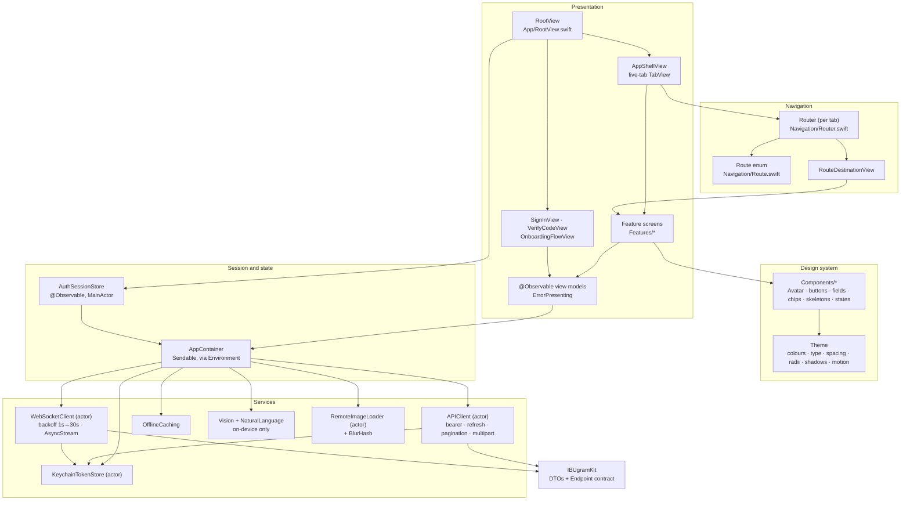

# IBUgram iOS — Client Architecture

Owner: iOS Platform Architect
Status: Foundation complete, open for feature work
Last updated: 2026-09-20

Every path in this document is relative to `ibugram-ios/`. The app target's module name is
`ibugram`, the bundle identifier is `ba.ibu.ibugram`.

---

## 1. Project facts

| Setting | Value |
| --- | --- |
| `objectVersion` | 77 (`preferredProjectObjectVersion = 77`) |
| Source membership | `PBXFileSystemSynchronizedRootGroup` for all three targets |
| `IPHONEOS_DEPLOYMENT_TARGET` | 18.0 |
| `SWIFT_VERSION` | 6.0 |
| `SWIFT_STRICT_CONCURRENCY` | `complete` |
| `TARGETED_DEVICE_FAMILY` | 1 (iPhone, portrait only) |
| Package dependency | `IBUgramKit` at `../IBUgramKit` (`XCLocalSwiftPackageReference`) |
| Shared scheme | `ibugram.xcodeproj/xcshareddata/xcschemes/ibugram.xcscheme` |

**Source files are discovered from disk.** The app target owns
`PBXFileSystemSynchronizedRootGroup` `ibugram`, so any `.swift` file placed anywhere under
`ibugram/` is compiled on the next build with no `project.pbxproj` edit. `ibugramTests/` and
`ibugramUITests/` work the same way. **Do not hand-edit `project.pbxproj`.** The only
membership exception is `ibugram/Info.plist`, which is consumed through `INFOPLIST_FILE`
rather than copied as a resource.

Build command:

```
xcodebuild -project ibugram.xcodeproj -scheme ibugram \
  -destination 'platform=iOS Simulator,name=iPhone 17 Pro,OS=26.3.1' build
```

The `OS=` component is required. Without it `xcodebuild` resolves `OS:latest` (iOS 27.0),
which has no `iPhone 17 Pro` device, and the destination lookup fails.

---

## 2. Layering

Dependencies point downward only. Nothing in a lower layer knows a higher layer exists.



---

## 3. Dependency injection

There are **no singletons**. Every service is reached through one `Sendable` value.

`ibugram/App/AppContainer.swift`

```swift
struct AppContainer: Sendable {
    let api: any APIRequesting
    let tokenStore: any TokenStoring
    let realtime: WebSocketClient
    let cache: any OfflineCaching
    let imageIntelligence: any ImageIntelligenceProviding
    let textIntelligence: any TextIntelligenceProviding
    let imageLoader: RemoteImageLoader
    let sessionInvalidation: SessionInvalidationSignal
}
```

Two factories: `AppContainer.live()` wires the real services; `AppContainer.preview()` wires
`MockAPIClient`, `InMemoryTokenStore`, `NullOfflineCache` and the stub intelligence services.

Injection is through the SwiftUI environment (`ibugram/App/AppContainerEnvironment.swift`):

```swift
extension EnvironmentValues {
    @Entry var appContainer: AppContainer = .preview()
}
```

The default is the preview container, so **every `#Preview` works with no setup and never
touches the network**. `IBUgramApp` overrides it with `.appContainer(container)`.

A view reads it and hands it to a view model; view models never read the environment:

```swift
@Environment(\.appContainer) private var container
@State private var viewModel: SignInViewModel?
...
.onAppear { viewModel = viewModel ?? SignInViewModel(api: container.api) }
```

### Why view models are `@State private var viewModel: Model?`

The container lives in the environment, which is not readable from a view's `init`. The
optional-plus-`onAppear` shape is the sanctioned pattern in this codebase. Where a `Binding`
into the view model is needed inside a helper method, use `Bindable(viewModel)`:

```swift
private func emailCard(_ viewModel: SignInViewModel) -> some View {
    let bound = Bindable(viewModel)
    return IBUTextField(title: "University email", placeholder: "…", text: bound.email, …)
}
```

---

## 4. Networking

`ibugram/Networking/APIClient.swift` — an `actor` over `URLSession`, generic over `Endpoint`.

```swift
protocol APIRequesting: Sendable {
    func send<E: Endpoint>(_ endpoint: E) async throws -> E.Response
}
```

What the client handles so no feature has to:

| Concern | Where |
| --- | --- |
| Bearer-token injection | `makeRequest(for:)`, only when `endpoint.requiresAuthentication` |
| Refresh on `401` + replay | `perform(_:allowingTokenRefresh:)` retries once after refresh |
| **Single-flight refresh** | `refreshInFlight: Task<TokenPair, Error>?`; concurrent 401s await the same task |
| Error envelope → typed error | `APIError.init(envelope:statusCode:retryAfter:)` in `Networking/APIError.swift` |
| `snake_case` + ISO-8601 fractional seconds | `Networking/JSONCoding.swift` |
| Cursor pagination | `Page<Item>` plus `Paginated<Item>` in `Networking/Paginated.swift` |
| Multipart upload | `Networking/MultipartFormData.swift`, used by `MediaEndpoint.Upload` |
| `204` responses | `EmptyResponse` short-circuits decoding |
| Refresh failure → sign out | `SessionInvalidationSignal`, observed by `AuthSessionStore` |

### Adding an endpoint

One file per resource under `ibugram/Networking/Endpoints/`. Copy
`UserEndpoint.Followers` for a paginated list and `AuthEndpoint.RequestCode` for a body:

```swift
struct DiscoverFeed: Endpoint {
    typealias Response = Page<Post>

    var cursor: String?
    var limit: Int = 20

    var path: String { "/feed/discover" }
    var queryItems: [URLQueryItem] {
        var items = [URLQueryItem(name: "limit", value: String(limit))]
        if let cursor { items.append(URLQueryItem(name: "cursor", value: cursor)) }
        return items
    }
}
```

`method` defaults to `.get`, `requiresAuthentication` to `true`, `body` to `nil`.

### Pagination

```swift
let feed = Paginated<Post> { cursor in
    try await container.api.send(FeedEndpoint.discover(cursor: cursor))
}
await feed.loadFirstPageIfNeeded()   // .task
await feed.loadNextPage()            // .onAppear of the last row
await feed.reload()                  // .refreshable
```

`feed.phase` is `.idle | .loading | .loaded | .failed(APIError)` — map it onto
`PostCardSkeleton`, content, `EmptyStateView` and `ErrorStateView`.

---

## 5. Authentication and session state

`ibugram/Persistence/TokenStore.swift` — `KeychainTokenStore` is an `actor` storing a
JSON-encoded `TokenPair` as a `kSecClassGenericPassword` item
(`kSecAttrAccessibleAfterFirstUnlockThisDeviceOnly`) through `Persistence/Keychain.swift`.
**Tokens never touch `UserDefaults`.** The prototype's `@AppStorage("signIn")` flag is gone.

`ibugram/Auth/AuthSessionStore.swift` — `@MainActor @Observable`, owns the only source of
truth for who is signed in:

```swift
enum State: Sendable, Equatable {
    case loading
    case signedOut
    case onboarding(User)
    case signedIn(User)
}
```

`RootView` switches on it: `.loading` → `LaunchView`, `.signedOut` → `SignInView`,
`.onboarding` → `OnboardingFlowView`, `.signedIn` → `AppShellView`. The store is published
into the environment, so any screen can call `session.signOut()` via
`@Environment(AuthSessionStore.self)`.

Domain validation lives in `ibugram/Auth/EmailDomainValidator.swift` and reads
`IBUgram.allowedEmailDomains` from `IBUgramKit` — the allow-list is not duplicated client-side.

---

## 6. Realtime

`ibugram/Realtime/WebSocketClient.swift` — an `actor` that owns one
`URLSessionWebSocketTask`, reconnects with exponential backoff (1 s doubling to a 30 s cap,
±20 % jitter, reset after a connection that actually opened), re-subscribes to its
conversations on every open, and sends a `ping` every 30 s.

Consumers get their own stream; frames are fanned out to all of them:

```swift
for await frame in await container.realtime.events() {
    guard frame.type == .messageCreated else { continue }
    let message = try frame.decodePayload(as: Message.self)
}
```

`ServerFrame` carries `type` plus the raw payload bytes, so the team that owns a DTO decodes
it; nobody has to wait for a shared frame enum to grow a case.

---

## 7. Navigation contract

**Feature teams do not invent navigation.** There is one vocabulary and one resolver.

1. `ibugram/Navigation/Route.swift` — the `Route` enum, every pushable screen in the app.
2. `ibugram/Navigation/Router.swift` — `@Observable` `path: [Route]`, one per tab.
3. `ibugram/Navigation/TabNavigationStack.swift` — wraps a tab root in its own
   `NavigationStack` and publishes the `Router` into the environment.
4. `ibugram/Navigation/RouteDestinationView.swift` — the single `switch` that maps a `Route`
   to a view.

To push from anywhere:

```swift
@Environment(Router.self) private var router
...
Button("Open profile") { router.push(.profile(username: user.username)) }
```

`router.pop()`, `router.popToRoot()` and `router.replaceStack(with:)` are also available.
Because every screen is reachable from one enum, **any screen can push any other screen**
with no coupling between features.

Modals are not routes. The Create tab is a button: selecting it flips
`isPresentingComposer` in `AppShellView` and leaves the previous tab selected.

---

## 8. Error presentation

One type and one modifier, so failures look the same everywhere.

- **A user action failed** → the view model conforms to `ErrorPresenting` (it declares
  `var presentedError: PresentedError?`) and calls `present(error, retry:)`. The view attaches
  `.errorAlert(bound.presentedError)`.
- **A screen failed to load** → render `ErrorStateView(error:retry:)`.

`PresentedError` maps an `APIError` to a title and to the localized copy in
`APIError.userFacingDescription`. Per the contract the server's `message` is only used as a
fallback for an unrecognized code, and `retry` is offered only when `APIError.isRetryable`.

---

## 9. Design system

Everything visual comes from `Theme` (`ibugram/DesignSystem/Theme.swift`), read as
`@Environment(\.theme)`. **No magic numbers in feature views.**

| Token group | Members |
| --- | --- |
| `colors` | `brand`, `brandMuted`, `brandContrast`, `accent`, `background`, `surface`, `surfaceSunken`, `separator`, `textPrimary/Secondary/Tertiary/OnBrand`, `destructive`, `success`, `warning`, `skeletonBase`, `skeletonHighlight` |
| `typography` | `displayLarge`, `displaySmall`, `titleLarge`, `titleSmall`, `headline`, `body`, `bodyEmphasis`, `callout`, `subheadline`, `footnote`, `caption`, `captionEmphasis`, `monospacedCode` |
| `spacing` | `hairline` 2, `xxs` 4, `xs` 8, `sm` 12, `md` 16, `lg` 20, `xl` 24, `xxl` 32, `xxxl` 48, `screenMargin` 20 |
| `radii` | `xs` 6, `sm` 10, `md` 14, `lg` 20, `xl` 28, `pill` |
| `shadows` | `subtle`, `card`, `elevated` — apply with `.shadow(theme.shadows.card)` |
| `motion` | `quick`, `standard`, `emphasis`, `shimmer` |

Colours are 19 asset colour sets in `ibugram/Assets.xcassets/Colors/`, each with an explicit
light and dark appearance. The brand navy is the university's `#003A6D`; dark mode lifts it to
`#5B9BE5` so it stays legible on `#0B0F14`. `AccentColor` carries the same pair, and
`launchBackground` drives the generated launch screen through
`INFOPLIST_KEY_UILaunchScreen_UIColorName`.

Typography is built from `Font.system(_:design:weight:)` text styles, so **Dynamic Type scales
for free**. `Shimmer` honours `accessibilityReduceMotion`.

### Component inventory

All under `ibugram/DesignSystem/Components/` unless noted. Every one has a `#Preview` in both
colour schemes.

| Component | File | Notes |
| --- | --- | --- |
| `AvatarView` | `AvatarView.swift` | `.small/.medium/.large/.extraLarge`, remote image → initials → `person.fill`, optional verified badge |
| `PrimaryButtonStyle` / `SecondaryButtonStyle` / `DestructiveButtonStyle` | `IBUButtonStyles.swift` | `.buttonStyle(.ibuPrimary)`, `.ibuPrimary(isLoading:)`, `.ibuSecondary`, `.ibuDestructive`; press scale and disabled state built in |
| `IBUTextField` | `IBUTextField.swift` | Caption, icon, inline message, `.neutral/.valid/.invalid` states, focus ring |
| `TagChip` | `TagChip.swift` | `.neutral/.brand/.accent`, optional icon, selected state |
| `SkeletonView`, `PostCardSkeleton` | `SkeletonView.swift` | Shimmering loading placeholders |
| `.shimmering()` | `Shimmer.swift` | Reusable shimmer modifier |
| `EmptyStateView` | `EmptyStateView.swift` | SF Symbol, title, message, optional action |
| `ErrorStateView` | `ErrorStateView.swift` | Typed `APIError`, retry button with in-flight state |
| `RefreshableScrollView` | `RefreshableScrollView.swift` | The app's only pull-to-refresh container |
| `RemoteImage` | `RemoteImage.swift` | Async load, BlurHash placeholder, shimmer fallback, alt-text accessibility label |
| `SectionHeader` | `SectionHeader.swift` | Title, subtitle, trailing action |
| `VerifiedBadge` | `VerifiedBadge.swift` | Faculty verification seal |
| `AppMarkView` | `AppMarkView.swift` | IBUgram product mark on the brand gradient |
| `BrandWordmark` | `BrandWordmark.swift` | University wordmark asset, light and dark variants |
| `BrandBackdrop` | `BrandBackdrop.swift` | Gradient backdrop for unauthenticated flows |
| `OneTimeCodeField` | `Auth/SignIn/OneTimeCodeField.swift` | Six boxed digits over one hidden field; paste, autofill and `.oneTimeCode` all work |

Supporting: `BlurHash.swift` (base-83 + inverse DCT decoder) and `RemoteImageLoader.swift`
(actor with a decoded-image LRU over a 256 MB `URLCache`).

---

## 10. Previews and mocks

`MockAPIClient` (`ibugram/Networking/Mock/MockAPIClient.swift`) is an `actor` conforming to
`APIRequesting`. Stubs are keyed `"<METHOD> <path>"`. An unstubbed endpoint throws
`.notFound` **on purpose** — a preview that silently renders empty is worse than one that
shows its error state.

```swift
#Preview("Feed") {
    FeedView()
        .appContainer(.preview())
}

#Preview("Feed · empty") {
    FeedView()
        .appContainer(.preview(api: MockAPIClient(stubs: ["GET /feed/following": Page<Post>(items: [])])))
}

#Preview("Feed · offline") {
    FeedView()
        .appContainer(.preview(api: MockAPIClient.failing(.offline)))
}

#Preview("Feed · loading") {
    FeedView()
        .appContainer(.preview(api: MockAPIClient.loadingForever()))
}
```

Fixtures live in `ibugram/Networking/Mock/SampleData.swift` (`amina` the student,
`professorKovac` the verified faculty member, `newcomer` mid-onboarding, plus a session,
a code challenge and `defaultStubs`). **Add your feature's fixtures there**, not in a new file.

### Running the app without a server

`ibugram/Support/LaunchConfiguration.swift` reads two launch arguments in `DEBUG` builds only:

```
xcrun simctl launch <udid> ba.ibu.ibugram \
  -ibugram-mock-api YES -ibugram-auth-state signed-in
```

`-ibugram-auth-state` accepts `signed-out`, `onboarding` or `signed-in`. Mock runs start with
no stored tokens unless `signed-in` is requested, so `-ibugram-mock-api YES` on its own lands
on the sign-in screen and lets you walk the whole OTP flow against fixtures. This is how the UI
tests and the report screenshots run with no backend.

---

## 11. Recipe: adding a screen

Worked example — the Space detail screen.

1. **Add the route.** In `ibugram/Navigation/Route.swift`, a case already exists
   (`case space(slug: String)`). If yours does not, add one. Payloads must be `Hashable`
   value types — ids and slugs, never whole DTOs.

2. **Add the endpoint.** New file `ibugram/Networking/Endpoints/SpaceEndpoint.swift`:

   ```swift
   enum SpaceEndpoint {
       struct Detail: Endpoint {
           typealias Response = Space
           let slug: String
           var path: String { "/spaces/\(slug)" }
       }
   }
   ```
   Use the DTOs from `IBUgramKit`. **Do not define DTOs in the app.**

3. **Add the view model.** `ibugram/Features/Spaces/SpaceDetailViewModel.swift`:

   ```swift
   @MainActor @Observable
   final class SpaceDetailViewModel: ErrorPresenting {
       private(set) var phase: Phase = .loading
       var presentedError: PresentedError?

       private let api: any APIRequesting
       private let slug: String

       init(api: any APIRequesting, slug: String) { … }

       func load() async {
           do { phase = .loaded(try await api.send(SpaceEndpoint.Detail(slug: slug))) }
           catch { phase = .failed(error.asAPIError) }
       }
   }
   ```

4. **Add the view**, one view per file, `body` under ~40 lines, all values from `theme`:

   ```swift
   struct SpaceDetailView: View {
       let slug: String

       @Environment(\.appContainer) private var container
       @Environment(\.theme) private var theme
       @State private var viewModel: SpaceDetailViewModel?

       var body: some View {
           content
               .background(theme.colors.background)
               .onAppear { viewModel = viewModel ?? SpaceDetailViewModel(api: container.api, slug: slug) }
               .task { await viewModel?.load() }
       }
   }
   ```

5. **Wire the destination.** In `ibugram/Navigation/RouteDestinationView.swift`, replace your
   `unbuilt(...)` call with the real view:

   ```swift
   case .space(let slug):
       SpaceDetailView(slug: slug)
   ```

6. **Add previews** — at minimum loaded, empty, error, and dark mode, all on
   `.appContainer(.preview(...))`.

7. **Add tests** in `ibugramTests/` using Swift Testing against `MockAPIClient`, named as
   sentences.

8. **Build.** Nothing to do to `project.pbxproj`; the synchronized group picks the files up.

Steps 1 and 5 are the only shared files you touch. Everything else is inside your own
directory, so six teams can work in parallel without conflicting.

---

## 12. Directory map

```
ibugram/
├── ibugramApp.swift                 @main, builds the container
├── IBUgramKitStubs.swift            TEMPORARY — delete when IBUgramKit lands (see §13)
├── Info.plist                       usage strings, ATS local networking
├── App/                             AppContainer, environment key, RootView, AppShellView, AppTab, LaunchView
├── Auth/                            AuthSessionStore, EmailDomainValidator, SignIn/, Onboarding/
├── Navigation/                      Route, Router, TabNavigationStack, RouteDestinationView
├── Networking/                      APIClient, APIError, APIConfiguration, JSONCoding, Paginated,
│                                    MultipartFormData, SessionInvalidationSignal, Endpoints/, Mock/
├── Persistence/                     Keychain, TokenStore, OfflineCache
├── Realtime/                        WebSocketClient, JSONValue
├── Intelligence/                    ImageIntelligence (Vision), TextIntelligence (NaturalLanguage)
├── DesignSystem/                    Theme, BlurHash, RemoteImageLoader, Components/
├── Features/                        one directory per team; placeholders to replace
├── Support/                         PresentedError, ErrorAlertModifier, LaunchConfiguration
└── Assets.xcassets/                 AppIcon, logo (light + dark), Colors/ (19 sets)
```

---

## 13. Outstanding integration work

`ibugram/IBUgramKitStubs.swift` holds local stand-ins for the shared contract, written against
`01-API-CONTRACT.md` while `IBUgramKit` was still being filled in: `Endpoint`, `HTTPMethod`,
`HTTPBody`, `EmptyResponse`, `Page`, `APIErrorCode`, `APIErrorEnvelope`, `User`, `UserRole`,
`UserCounts`, `ViewerRelationship`, `Media`, `AuthSession`, `OneTimeCodeChallenge`,
`ServerFrame`, `ServerFrameType`, `ClientFrame`, `ClientFrameType`.

The app already links `IBUgramKit` and uses `IBUgram.allowedEmailDomains` and
`IBUgram.apiVersionPath` from it, so the dependency is live.

To integrate, in one commit:

1. Delete `ibugram/IBUgramKitStubs.swift`.
2. Add `import IBUgramKit` to the files that referenced those names.
3. Reconcile any naming differences (the stubs follow the contract's wire names converted to
   `camelCase`).

Two requirements on the package for this to compile:

- The DTOs need **public memberwise initializers**. A `public struct`'s synthesized memberwise
  init is `internal`, so `SampleData` and the tests cannot construct fixtures without them.
- `User`, `Media` and `Page.Item` should be `Sendable`, `Hashable` and `Identifiable`; the
  app's `Paginated` and SwiftUI's `ForEach` rely on it.

One deliberate deviation from the contract: there is no username-availability endpoint, so
`OnboardingViewModel` uses `GET /users/:username` and reads `not_found` as "available". If the
server adds a dedicated endpoint, swap it there.

`ibugram/Persistence/OfflineCache.swift` ships a working JSON-on-disk `FileSystemOfflineCache`
behind the `OfflineCaching` protocol. The Offline-first team replaces the implementation with
SwiftData plus the outbox; callers depend only on the protocol.
